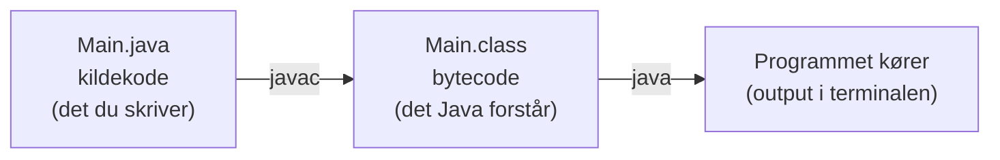

# Introdag 2 – installation og Java i Notepad

## Beskrivelse

I dag får vi værktøjerne på plads, og vi skriver vores første Java-program.

Vi starter et lidt usædvanligt sted: i en helt almindelig teksteditor og en terminal. Det er
langsommere end at bruge et rigtigt udviklingsværktøj – men det er også den eneste måde at se,
hvad der **faktisk** sker, når et Java-program bliver til.

Bagefter installerer vi IntelliJ IDEA, som gør alt det samme for os, og som vi bruger resten af
semesteret.

> **Medbring din bærbare computer, og hav den fuldt opladet.** Dagen i dag foregår på din egen
> maskine.

## Læringsmål

Når du har været igennem dagen, skal du kunne:

* forklare forskellen på **kildekode**, **bytecode** og **kørsel**
* forklare hvad JDK, JVM, `javac` og `java` er
* skrive, kompilere og køre et Java-program fra kommandolinjen
* oprette et Java-projekt i IntelliJ og køre det derfra
* forklare, hvorfor filnavn og klassenavn skal være ens
* læse en fejlmeddelelse fra compileren og finde linjen, der er noget galt med
* have JDK, IntelliJ og Git installeret og virkende på din egen computer

## Forberedelse

Ingen video i dag. Men gør følgende **inden** du møder op:

* Sørg for at din computer er **fuldt opladet** og har plads på disken (regn med ca. 5 GB).
* Sørg for at du kan logge på EK's systemer – mail, itslearning og Teams.
* Hvis du kan, så [opret en GitHub-konto](https://github.com/signup) på forhånd. Brug gerne din
  EK-mail. Vælg et brugernavn, du er tryg ved at have stående offentligt – det følger dig
  resten af studiet og formentlig ind i dit arbejdsliv.

Har du allerede installeret Java og IntelliJ derhjemme, er det fint – så hjælper du i stedet dem i
studiegruppen, der ikke er nået så langt.

---

## Det vi skal installere

| Værktøj | Hvad det er | Hvor |
| --- | --- | --- |
| **JDK 21** (eller nyere) | Java Development Kit – selve Java, inkl. compiler | [adoptium.net](https://adoptium.net/) |
| **IntelliJ IDEA Community** | Vores udviklingsværktøj (IDE) | [jetbrains.com/idea/download](https://www.jetbrains.com/idea/download/) |
| **Git** | Versionsstyring – vi bruger det fra uge 39 | [git-scm.com/downloads](https://git-scm.com/downloads) |

> **IntelliJ IDEA Community Edition** er gratis og fuldt tilstrækkelig. Du kan senere søge om en
> gratis studielicens til Ultimate-udgaven med din EK-mail, men det haster ikke.

---

## Java i Notepad – hvad sker der egentlig?

Når du senere trykker på den grønne pil i IntelliJ, sker der tre ting bag kulisserne. I dag laver
vi dem i hånden, så du har set dem én gang.



### Trin 1 – skriv kildekoden

Opret en mappe til dagens arbejde, og lav en fil, der hedder præcis:

```text
Main.java
```

Skriv dette i filen med en helt almindelig teksteditor – Notepad på Windows, TextEdit på Mac
(husk *Format → Make Plain Text*), eller `gedit`/`nano` på Linux:

```java
public class Main {

    public static void main(String[] args) {

        System.out.println("Hello, world!");
    }
}
```

> **Vigtigt:** Filen skal hedde `Main.java` – med stort M. Java kræver, at filnavnet er nøjagtig
> det samme som navnet på den `public class`, der står i filen. Gemmer Notepad filen som
> `Main.java.txt`, virker det ikke. Vælg "Alle filer" i gem-dialogen.

### Trin 2 – kompilér

Åbn en terminal (Kommandoprompt eller PowerShell på Windows, Terminal på Mac/Linux), og gå til den
mappe, hvor filen ligger:

```bash
cd sti/til/din/mappe
```

Kompilér nu filen:

```bash
javac Main.java
```

Hvis alt går godt, sker der **ingenting** – der kommer ikke noget output. Det er et godt tegn. Kig
i mappen: der er nu dukket en ny fil op:

```text
Main.class
```

Det er **bytecode**. Prøv at åbne den i din teksteditor. Det ser ud som volapyk – og det er
meningen. Den er skrevet til maskinen, ikke til dig.

### Trin 3 – kør programmet

```bash
java Main
```

Bemærk: **uden** `.java` og **uden** `.class`. Du skriver navnet på klassen, ikke navnet på filen.

Output:

```text
Hello, world!
```

Tillykke. Det er dit første Java-program.

---

### Prøv at lave en fejl med vilje

Det her er faktisk vigtigere end at få programmet til at virke. Fjern semikolonet:

```java
System.out.println("Hello, world!")
```

Kompilér igen:

```bash
javac Main.java
```

Nu får du en fejlmeddelelse, der ligner denne:

```text
Main.java:5: error: ';' expected
        System.out.println("Hello, world!")
                                           ^
1 error
```

Læg mærke til, hvad compileren fortæller dig:

* **`Main.java:5`** – hvilken fil og hvilken **linje**
* **`error: ';' expected`** – hvad den savner
* **`^`** – hvor på linjen den stod, da den opdagede problemet

Det er værd at vænne sig til fra dag ét: **fejlmeddelelser er hjælp, ikke skældud.** De fleste
begynderfejl kan løses ved at læse den første fejllinje ordentligt. Og læs altid den **øverste**
fejl først – de nederste er ofte følgefejl.

Prøv også disse fejl, og se hvad compileren siger:

1. Stav `System` med lille `s`
2. Fjern en `}` til sidst
3. Omdøb klassen til `Hello`, men behold filnavnet `Main.java`

---

## Fra Notepad til IntelliJ

Nu hvor du har set, hvad der sker, kan vi lade værktøjet gøre det.

1. Start IntelliJ IDEA
2. **New Project**
3. Vælg **Java**, og vælg din JDK i feltet *JDK* (vælg "Download JDK", hvis den er tom)
4. Giv projektet et navn, og opret det
5. Højreklik på mappen `src` → **New → Java Class** → navngiv den `Main`
6. Skriv `main` og tryk <kbd>Tab</kbd> – IntelliJ udfylder hele `main`-metoden for dig
7. Skriv `sout` og tryk <kbd>Tab</kbd> – IntelliJ skriver `System.out.println();`
8. Tryk på den grønne pil ▶ ved siden af `main`-metoden

Programmet kører, og output står i vinduet nederst.

Det, IntelliJ lige har gjort for dig, er præcis de to kommandoer, du selv skrev før: `javac` og
`java`.

### Genveje, det betaler sig at lære nu

| Genvej (Win/Linux) | Mac | Hvad den gør |
| --- | --- | --- |
| `sout` + <kbd>Tab</kbd> | samme | Indsætter `System.out.println();` |
| `main` + <kbd>Tab</kbd> | samme | Indsætter hele `main`-metoden |
| <kbd>Ctrl</kbd>+<kbd>Alt</kbd>+<kbd>L</kbd> | <kbd>Cmd</kbd>+<kbd>Alt</kbd>+<kbd>L</kbd> | Formatér koden pænt |
| <kbd>Shift</kbd>+<kbd>F10</kbd> | <kbd>Ctrl</kbd>+<kbd>R</kbd> | Kør programmet igen |
| <kbd>Ctrl</kbd>+<kbd>/</kbd> | <kbd>Cmd</kbd>+<kbd>/</kbd> | Kommentér linjen ud |
| <kbd>Shift</kbd> <kbd>Shift</kbd> | samme | Søg efter hvad som helst |

---

## Aktiviteter i undervisningen

Arbejd med disse [opgaver](opgaver.md)

Dagens mål er, at **alle** i studiegruppen går herfra med et virkende opsætning. Er du hurtigt
færdig, så hjælp dem ved siden af dig – det er sådan, studiegruppen kommer til at fungere resten
af semesteret.
