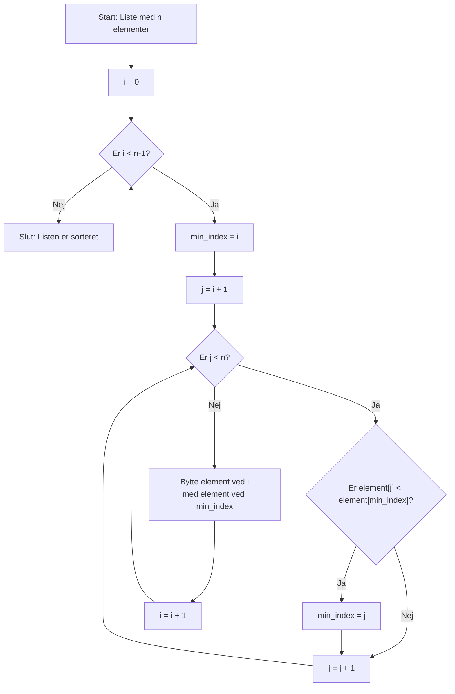

# Selection Sort

## Grundlæggende koncept

**Selection sort** er en simpel sorteringsalgoritme, der sorterer en liste ved gentagne gange at finde det mindste element og flytte det til sin korrekte position.

Selection sort virker således:
1. Find det mindste element i den usorterede del
2. Bytte det mindste element med det første element i den usorterede del
3. Flyt grænsen mellem sorteret og usorteret del en plads til højre
4. Gentag indtil hele listen er sorteret

## Visuel demonstration

Lad os sortere listen: `[64, 25, 12, 22, 11]`

**Iteration 1:** Find minimum blandt alle 5 elementer
```
[64, 25, 12, 22, 11]
      ↑           ↑
    startpos    min=11

↓ Bytte 64 og 11

[11, 25, 12, 22, 64]
 ✓
```

**Iteration 2:** Find minimum blandt de sidste 4 elementer
```
[11, 25, 12, 22, 64]
 ✓       ↑
        min=12

↓ Bytte 25 og 12

[11, 12, 25, 22, 64]
 ✓  ✓
```

**Iteration 3:** Find minimum blandt de sidste 3 elementer
```
[11, 12, 25, 22, 64]
 ✓  ✓       ↑
           min=22

↓ Bytte 25 og 22

[11, 12, 22, 25, 64]
 ✓  ✓  ✓
```

**Iteration 4:** Find minimum blandt de sidste 2 elementer
```
[11, 12, 22, 25, 64]
 ✓  ✓  ✓       ↑
              min=25

↓ Allerede på plads

[11, 12, 22, 25, 64]
 ✓  ✓  ✓  ✓
```

**Iteration 5:** Sidste element
```
[11, 12, 22, 25, 64]
 ✓  ✓  ✓  ✓  ✓
```

## Flowdiagram



## Pseudokode

<details>
<summary><strong>📝 Hint: Pseudokode (klik for at vise)</strong></summary>

```
procedure selectionSort(array A)
    for i from 0 to length(A) - 2
        min_index = i
        for j from i + 1 to length(A) - 1
            if A[j] < A[min_index]
                min_index = j
        // Bytte
        temp = A[i]
        A[i] = A[min_index]
        A[min_index] = temp
    end for
end procedure
```

</details>

## Karakteristika

| Aspekt | Værdi |
|--------|-------|
| **Tidskompleksitet** | O(n²) - både bedste, worst-case og gennemsnit |
| **Plads kompleksitet** | O(1) - sorterer in-place |
| **Stabilitet** | Ustabil (bytter kan ændre rækkefølgen af lige elementer) |
| **Adaptivitet** | Ikke adaptiv (samme tid uanset sorterings-tilstand) |
| **Sammenligninger** | n(n-1)/2 sammenligninger |
| **Bytninger** | Maksimalt n-1 bytninger |

## Fordele og ulemper

✅ **Fordele:**
- Meget simpel at implementere
- Ingen ekstra hukommelse nødvendig (in-place)
- Få bytninger (god for dyre bytningsoperationer)

❌ **Ulemper:**
- Langsom for store datasæt (O(n²))
- Ikke bedre end bubble sort
- Ustabil sortering
