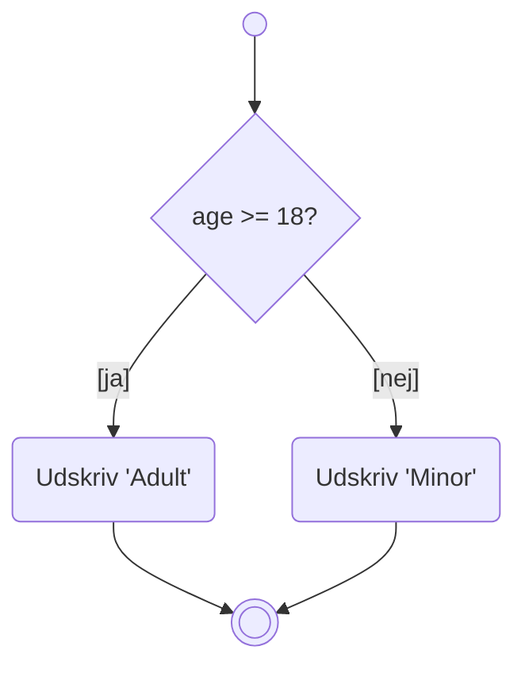
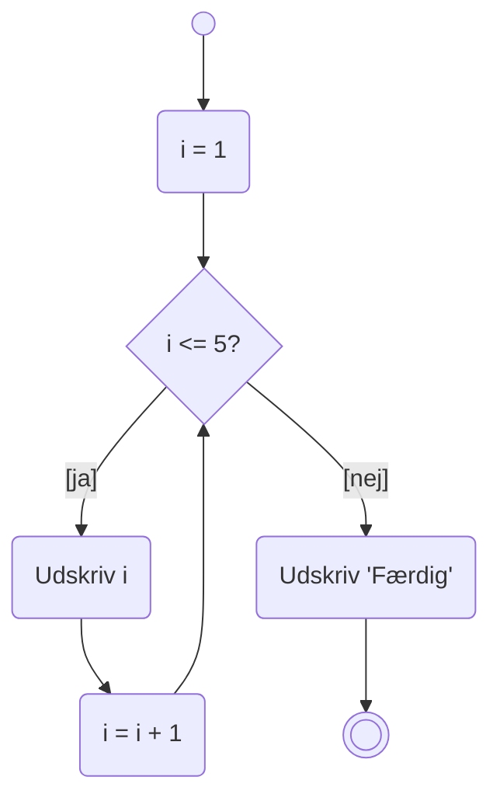
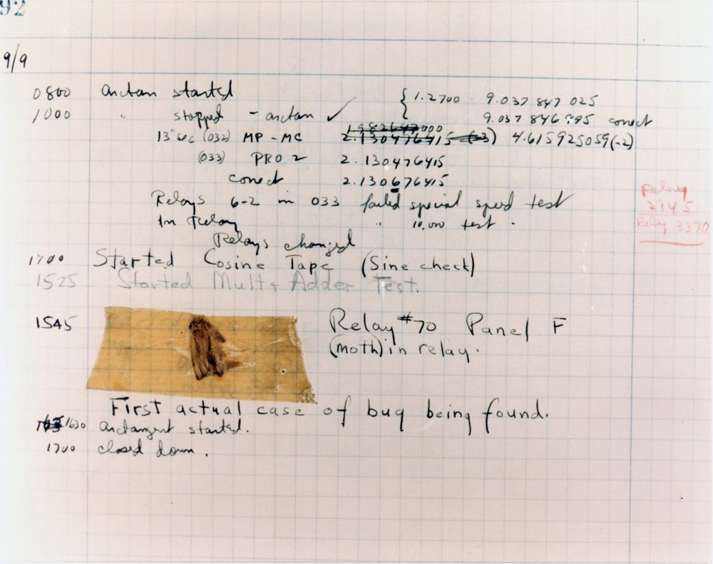

# Design: Aktivitetsdiagram og debugger

## Beskrivelse

I dag handler det ikke om at skrive kode, men om at **forstå den** – før og efter den er skrevet.

Vi lærer to værktøjer:

**Aktivitetsdiagrammet** er et tegneværktøj til at planlægge et forløb, *før* vi koder. Det er
UML's svar på et flowchart, og det er den bedste måde at få styr på en kompliceret beslutning eller
et forløb med mange udfald – uden at drukne i syntaks.

**Debuggeren** er værktøjet til at se, hvad koden *faktisk* gør, når den kører. Den er langt
hurtigere end at strø `System.out.println` ud over det hele – og den er den eneste måde at finde
visse fejl.

De to hænger sammen: aktivitetsdiagrammet er kortet, debuggeren er GPS'en.

## Læringsmål

Når du har arbejdet med dagens materiale, skal du kunne:

* tegne et aktivitetsdiagram med start, actions, decisions og slut
* bruge de rigtige former: **runde hjørner** til actions, **diamant** til decisions
* skrive betingelser i `[kantede parenteser]` på pilene ud fra en decision
* tegne et diagram, hvor hver decision har præcis to udfald, og hvor linjerne ikke krydser
* oversætte et aktivitetsdiagram til Java-kode og omvendt
* sætte et **breakpoint** og starte programmet i debug-tilstand
* bruge **Step Over**, **Step Into** og **Step Out**
* aflæse variables værdier undervejs i **Variables**-vinduet
* bruge **Evaluate Expression** til at prøve noget af, mens programmet står stille
* forklare hvorfor debuggeren ofte er hurtigere end `System.out.println`

## Se disse videoer før undervisningen:

Der er ingen video i kursusrækken til dagens emner. Læs i stedet:

* [What is an Activity Diagram?](https://www.visual-paradigm.com/guide/uml-unified-modeling-language/what-is-activity-diagram/)
  (Visual Paradigm) – læs afsnittene om *Activity Diagram Notations* og se eksemplerne
* [Debug your first Java application](https://www.jetbrains.com/help/idea/debugging-your-first-java-application.html)
  (JetBrains) – følg gerne med i IntelliJ, mens du læser

## Læs nedenstående før undervisningen

---

# Del 1: Aktivitetsdiagrammet

## Hvorfor tegne, før man koder?

Prøv at læse denne beskrivelse:

> Når spilleren angriber, skal vi først tjekke, om hun overhovedet har et våben. Har hun det, skal
> vi tjekke om våbenet kan bruges – skydevåben har jo begrænset ammunition. Kan det bruges, skal vi
> finde ud af, om der er en fjende i rummet. Er der det, mister fjenden health – og hvis fjenden
> dør, dropper den sit våben og forsvinder. Ellers slår fjenden igen.

Kan du kode det direkte? De fleste kan ikke. Der er for mange spor at holde styr på i hovedet på
én gang.

Tegner du det derimod op, kan du se alle vejene igennem på én gang – og opdage de tilfælde, du
havde glemt.

> **Det er præcis denne opgave, I får i [Adventure del 5](../../projekter/adventure/del-5-enemies.md).**
> Dagens materiale er forberedelsen til den.

---

## Elementerne

| Element | Form | Bemærk |
| --- | --- | --- |
| **Start** (initial) | Udfyldt sort cirkel | Der er præcis én |
| **Slut** (final) | Cirkel med ring om | Der må gerne være flere |
| **Action** | Rektangel med **runde hjørner** | En ting der sker |
| **Decision** | Diamant ◇ | Et valg |
| **Signal** | "Flag" | Brugerinteraktion, fx et klik |
| **Timer** | "Timeglas" | Fx "vent 2 minutter" |
| **Objekt** | Rektangel med **skarpe hjørner** | Data der føres videre |

> **Hvorfor runde hjørner på actions?** Fordi **skarpe hjørner betyder "objekt"**. Det er ikke
> pynt – formen er en del af sproget. Tegner du en action med skarpe hjørner, siger du noget andet,
> end du mener.

### Start og slut

Diagrammet begynder ét sted og ender ét eller flere steder. Der er altid en vej fra start til en
slutning.

### Actions

En action er noget, der sker. Skriv, hvad der sker – gerne som et udsagnsord:

```text
( Læs brugerens input )
( Beregn totalprisen )
( Udskriv kvitteringen )
```

Fra en action går der **én** pil videre.

### Decisions

En decision er et valg. Fra diamanten går der to (eller flere) pile, og hver pil er mærket med
betingelsen i **kantede parenteser**:

```text
        ◇ Har spilleren et våben?
       /                       \
  [ja]                          [nej]
```

Bemærk: betingelsen står på **pilen**, ikke inde i diamanten. Inde i diamanten står spørgsmålet.

### Signals og timers

Venter programmet på brugeren, tegnes det som et flag:

```text
▷ Brugeren indtaster sit navn
```

Venter det på tid, tegnes et timeglas:

```text
⧗ Vent 5 minutter
```

---

## Et simpelt eksempel

Sådan ser en `if`/`else` ud som aktivitetsdiagram:

```java
if (age >= 18) {
    System.out.println("Adult");
}
else {
    System.out.println("Minor");
}
```



Bemærk at de to grene **samles igen** før slutningen. Det er som regel det, man vil – ellers får man
et diagram med rigtig mange slutninger.

## Et loop

Et loop tegnes som en pil, der går tilbage:

```java
int i = 1;

while (i <= 5) {
    System.out.println(i);
    i++;
}

System.out.println("Færdig");
```



Læg mærke til, at det er nøjagtig de tre dele fra et `for`-loop: **start**, **betingelse**,
**ændring**. De er bare tegnet i stedet for skrevet.

---

## Tre regler, der gør diagrammet godt

Det er let at tegne et diagram, der er lige så uoverskueligt som koden. Disse tre regler hjælper:

### 1. Hver decision har præcis to udfald

Et spørgsmål med tre svar er i virkeligheden to spørgsmål. Del det op.

### 2. Linjerne må ikke krydse

Hvis resultatet af én decision både optræder i ja-grenen og inde i en anden decisions nej-gren, er
diagrammet forkert.

> Tænk på det som kode: du kan ikke få den **samme** kodeblok til både at køre i en `else` **og**
> længere inde i en anden `if`-sætning. Kan det ikke skrives, kan det heller ikke tegnes.

### 3. Så få gentagne actions som muligt

Har du tegnet "Gå udenfor" tre forskellige steder, så saml dem til én action, som flere pile peger
ind i. Det er ofte her, diagrammet bliver markant enklere – og det afslører tit, at koden også kan
forenkles.

---

## Ekstra notation (godt at kunne genkende)

Du behøver ikke bruge det selv endnu, men du kommer til at se det:

**Objekter mellem actions.** Et rektangel med skarpe hjørner er data, der føres fra én action til
den næste:

```text
( Indlæs fulde navn ) → [fulde navn] → ( Find fornavn ) → [fornavn] → ( Udskriv "Hej fornavn" )
```

Output fra én action er input til den næste. De to behøver ikke hedde det samme.

**Expansion region.** En ramme om en action betyder "gør dette for hvert element i listen":

```text
( Opret opskrift ) → [ingredienser] → ⟦ ( Udskriv ingrediens ) ⟧ → ( Udskriv opskrift )
```

Det svarer til et loop over en liste.

**Parallelle actions.** En tyk streg (*split*) deler flowet op, og en tilsvarende streg (*join*)
samler det igen. Alle grene skal være færdige, før man kan gå videre:

```text
( Sæt dig i sofaen )
        ═══════════ split
        ↓     ↓      ↓
    (Spis) (Drik) (Se YouTube)
        ↓     ↓      ↓
        ═══════════ join
( Rejs dig fra sofaen )
```

---

# Del 2: Debuggeren

## Hvorfor ikke bare println?



*9. september 1947 gik Harvard Mark II-computeren i stå. Fejlen var et møl, der havde sat sig
fast i relæ 70. Operatørerne tapede det ind i logbogen og skrev: "First actual case of bug being
found." Ordet **bug** var allerede i brug om tekniske fejl — men det her er den første gang,
nogen bogstaveligt talt fandt en. Og det er derfor, du i dag skal lære at **debugge**.*

`System.out.println` virker – men den har tre problemer:

1. Du skal **gætte på forhånd**, hvad du vil se. Rammer du forkert, skal du rette og køre igen.
2. Du skal **rydde op** bagefter. Glemmer du en, står den i din aflevering.
3. Du kan ikke se **alt** på én gang – kun det, du huskede at skrive ud.

Debuggeren løser alle tre. Den standser programmet midt i det hele og lader dig kigge på **alle**
variable, uden at ændre en eneste linje kode.

---

## Sådan gør du

### 1. Sæt et breakpoint

Klik i den grå margen til venstre for et linjenummer. Der kommer en rød prik.

Et **breakpoint** betyder: "stop programmet lige her, før denne linje kører."

### 2. Start i debug-tilstand

Tryk på **billen** 🐞 i stedet for den grønne pil ▶.

Programmet kører, indtil det rammer dit breakpoint, og standser så.

### 3. Kig på variablene

Nederst dukker **Debug**-vinduet op. I fanen **Variables** kan du se alle variable, der findes lige
nu, og hvad de indeholder.

IntelliJ viser også værdierne **direkte i koden**, i grå tekst til højre for hver linje.

### 4. Gå videre, ét skridt ad gangen

| Knap | Genvej | Gør hvad |
| --- | --- | --- |
| **Step Over** | <kbd>F8</kbd> | Kør denne linje, og stop på den næste |
| **Step Into** | <kbd>F7</kbd> | Hop **ind i** den metode, linjen kalder |
| **Step Out** | <kbd>Shift</kbd>+<kbd>F8</kbd> | Kør resten af denne metode færdig, og kom tilbage |
| **Resume** | <kbd>F9</kbd> | Kør videre til næste breakpoint |
| **Stop** | <kbd>Ctrl</kbd>+<kbd>F2</kbd> | Afbryd programmet |

**Step Over** er den, du bruger mest. Brug **Step Into**, når du er i tvivl om, hvad en af dine egne
metoder gør – men ikke på `System.out.println`, medmindre du gerne vil se Javas indmad.

Er du hoppet et sted hen, hvor du ikke vil være, så brug **Step Out**.

---

## De to vinduer, du skal kende

### Variables

Viser alle variable i det nuværende scope, og hvad de indeholder. Objekter kan foldes ud, så du kan
se deres attributter.

Det er her, du opdager, at `sum` er `0`, når du troede, den var `55`.

### Evaluate Expression

<kbd>Alt</kbd>+<kbd>F8</kbd>, eller markér noget kode og tryk <kbd>Alt</kbd>+<kbd>F8</kbd>.

Her kan du skrive et hvilket som helst Java-udtryk og få det beregnet **med de værdier, programmet
har lige nu**:

```java
grades[i]
sum / grades.length
name.substring(0, 3)
i < grades.length
```

Det er ekstremt nyttigt: du kan afprøve en idé, uden at ændre koden og køre forfra.

---

## Betingede breakpoints

Har du et loop, der kører 1000 gange, og fejlen sker først ved nr. 743, gider du ikke trykke
<kbd>F9</kbd> 743 gange.

**Højreklik** på breakpointet, og skriv en betingelse:

```java
i == 743
```

Nu stopper programmet kun der.

Det samme trick virker på fejl: sæt betingelsen til `grades[i] < 0`, og programmet stopper præcis
i det gennemløb, hvor der er noget galt.

---

## En fremgangsmåde, der virker

Når noget ikke gør, som du forventer:

1. **Formulér, hvad du forventer.** "Efter loopet skulle `sum` være 55."
2. **Sæt et breakpoint** lige efter det sted, hvor det burde være rigtigt.
3. **Kig i Variables.** Er værdien forkert?
4. **Ryk breakpointet tilbage**, og gå fremad med <kbd>F8</kbd>, indtil du ser værdien blive forkert.
5. **Nu ved du hvilken linje.** Det er som regel nok.

> Fejlfinding er ikke at stirre på koden, indtil man ser fejlen. Det er at indsnævre, hvor den kan
> være – som en søgning. Debuggeren er det værktøj, der halverer søgeområdet hver gang.

---

### Prøv det selv inden timen

Kør dette program i debuggeren. Det skal beregne summen af tallene, men gør det ikke:

```java
public class Main {

    public static void main(String[] args) {

        int[] numbers = {5, 10, 15, 20};
        int sum = 0;

        for (int i = 0; i < numbers.length; i++) {
            sum = numbers[i];
        }

        System.out.println("Summen er " + sum);
    }
}
```

1. Hvad forventer du, der bliver skrevet ud?
2. Hvad bliver der faktisk skrevet ud?
3. Sæt et breakpoint på linjen `sum = numbers[i];`
4. Kør i debug-tilstand, og tryk <kbd>F9</kbd> fire gange. Hold øje med `sum` og `i` i Variables.
5. Hvad er fejlen?

---

## Det vigtigste at tage med

**Aktivitetsdiagram**

* runde hjørner = action, diamant = decision, skarpe hjørner = objekt
* betingelser skrives i `[kantede parenteser]` på pilene
* hver decision har to udfald, linjerne krydser ikke, og actions gentages ikke unødigt
* et loop er en pil, der går tilbage
* **tegn før du koder**, når der er mange udfald at holde styr på

**Debugger**

* breakpoint = "stop her"
* 🐞 i stedet for ▶
* <kbd>F8</kbd> Step Over, <kbd>F7</kbd> Step Into, <kbd>Shift</kbd>+<kbd>F8</kbd> Step Out,
  <kbd>F9</kbd> Resume
* **Variables** viser alt; **Evaluate Expression** (<kbd>Alt</kbd>+<kbd>F8</kbd>) lader dig prøve
  noget af
* betingede breakpoints til loops
* fejlfinding er indsnævring, ikke stirren

## Aktiviteter i undervisningen

Arbejd med disse [opgaver](opgaver.md)
