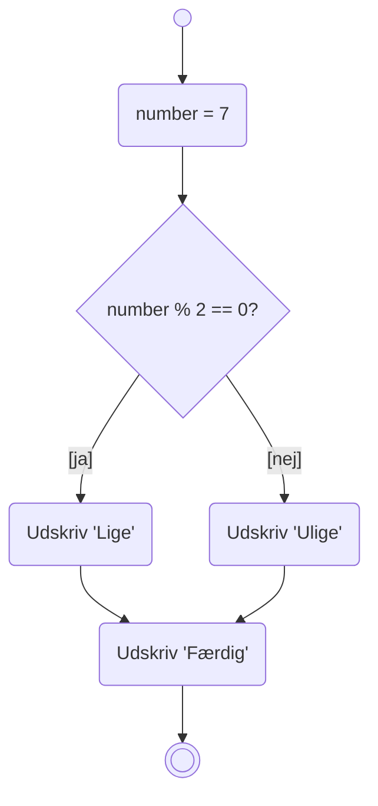
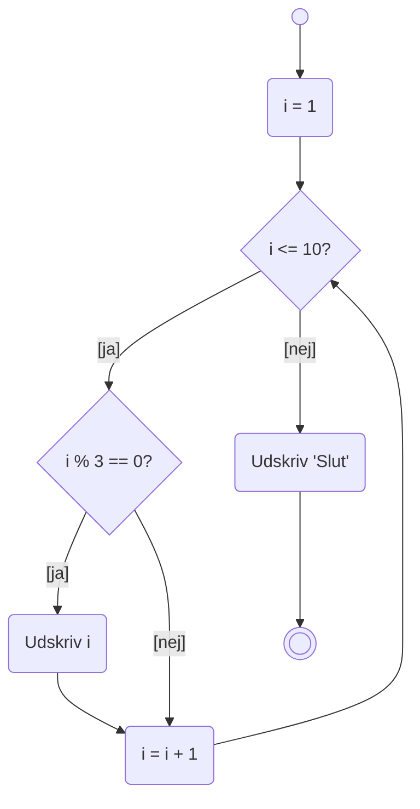
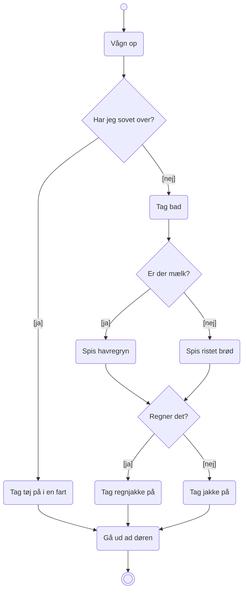
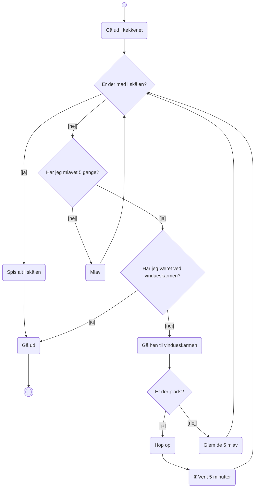
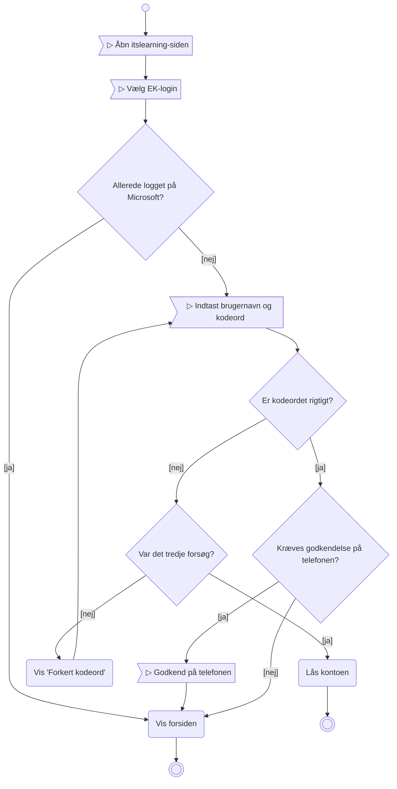
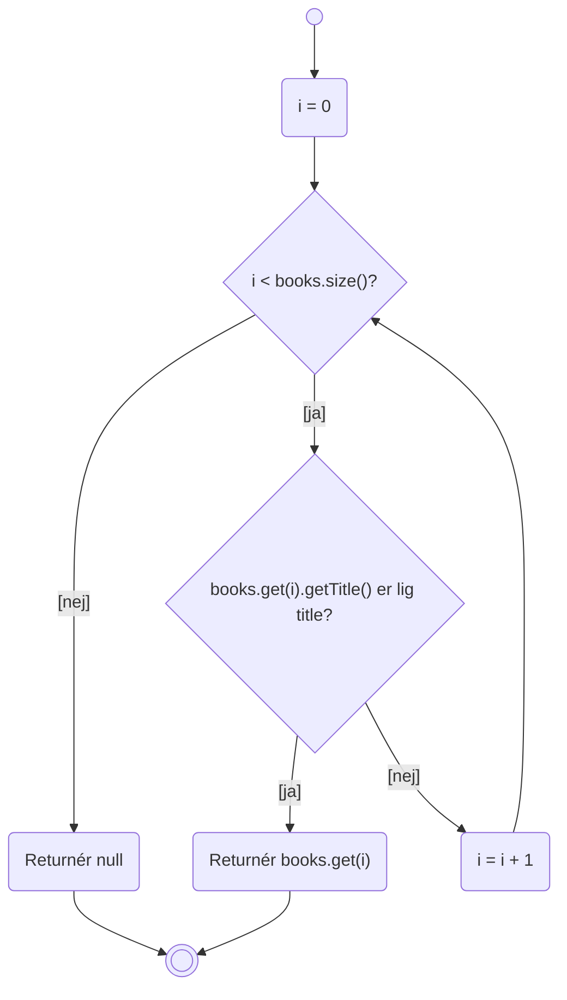
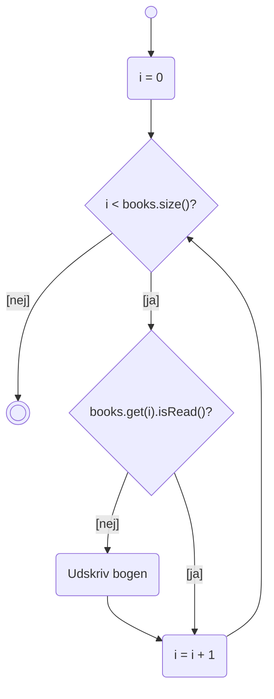
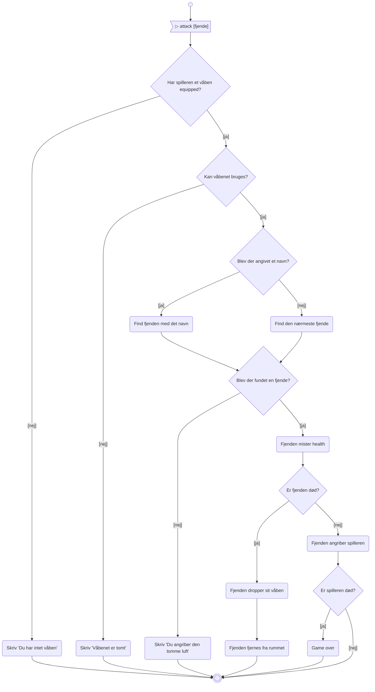

# Vejledende løsninger – Aktivitetsdiagrammer

Her er vejledende løsninger til tegneopgaverne i [opgaver.md](opgaver.md) (Del 1 og de to
udfordringer). Debugger-opgaverne i Del 2 har ikke én rigtig løsning – der skal du bare gøre det.

> **Vejledende** betyder: dit diagram må gerne se anderledes ud. Det vigtige er, at det følger
> reglerne – runde hjørner på actions, diamant på decisions, betingelser i `[kantede parenteser]`,
> præcis to udfald pr. decision, ingen krydsende linjer og så få gentagne actions som muligt.

Diagrammerne er tegnet i Mermaid, fordi GitHub kan vise dem. Mermaid har ikke et timeglas eller et
flag som form, så de er skrevet med symbolerne ⧗ og ▷ inde i kassen. På papir tegner du de rigtige
former.

---

## Opgave 1 – Fra kode til diagram



Det vigtigste at få med:

* De to grene **samles igen** før "Udskriv 'Færdig'". Den linje står *uden for* `if`/`else` i
  koden, så den køres altid – og derfor må den kun tegnes én gang.
* Tildelingen `number = 7` er en action. Man kan godt udelade den, hvis diagrammet handler om
  selve beslutningen, men så skal det være tydeligt, hvor `number` kommer fra.

---

## Opgave 2 – Et loop



**Hvor mange decisions er der?** To: loopets betingelse (`i <= 10?`) og `if`-sætningen inde i
loopet (`i % 3 == 0?`).

**Hvor går pilen tilbage til?** Til loopets betingelse `i <= 10?` – *ikke* til `i = 1`. Gik den
tilbage til `i = 1`, ville `i` blive nulstillet hver gang, og loopet ville aldrig slutte.

Læg mærke til, at `i = i + 1` kun er tegnet én gang, selvom man kommer dertil ad to veje. Det
svarer til, at `i++` står *efter* `if`-sætningen i koden og derfor altid køres.

Programmet udskriver `3`, `6`, `9` og `Slut`.

---

## Opgave 3 – Fra diagram til kode

Diagrammet har en decision inde i ja-grenen af en anden decision. Det oversættes direkte til en
`if` inde i en `if`:

```java
import java.util.Scanner;

public class Main {

    public static void main(String[] args) {

        Scanner scanner = new Scanner(System.in);

        System.out.print("Hvor gammel er du? ");
        int alder = scanner.nextInt();

        boolean harKoerekort = true;   // diagrammet siger ikke, hvor dette kommer fra

        if (alder >= 18) {

            if (harKoerekort) {
                System.out.println("Må køre");
            }
            else {
                System.out.println("Mangler kørekort");
            }
        }
        else {
            System.out.println("For ung");
        }
    }
}
```

Bemærk:

* "Læs alderen" er en action, så den bliver til kode (her `scanner.nextInt()`). Diagrammet siger
  ikke, hvor "Har kørekort?" kommer fra, så her er det bare en variabel.
* Diagrammet har **tre slutninger**, og koden har tre `println`-linjer, som hver især er det sidste,
  der sker. Det passer.
* Man kan også skrive det som en flad `else if`-kæde:

```java
if (alder < 18) {
    System.out.println("For ung");
}
else if (!harKoerekort) {
    System.out.println("Mangler kørekort");
}
else {
    System.out.println("Må køre");
}
```

Begge versioner gør det samme. Den indlejrede version ligner diagrammet mest, og den flade er
nemmere at læse, når kæden bliver lang.

---

## Opgave 4 – Morgenrutine

Der er ikke ét rigtigt svar – det er *din* morgen. Her er et eksempel, der opfylder kravene:



Tjekliste, når du kigger på dit eget (eller sidemandens) diagram:

* **Mindst tre decisions**, hver med præcis to udfald. "Hvad skal jeg spise?" med tre svar skal
  deles op i to spørgsmål.
* **Grene samles igen**, når de har samme fortsættelse. "Er der mælk?" giver to forskellige
  morgenmader, men bagefter er man det samme sted – så de to pile peger ind i den samme decision.
* **"Gå ud ad døren" står én gang**, selvom man kommer dertil ad flere veje.
* Kan sidemanden følge det uden forklaring? Hvis ikke, mangler der som regel en betingelse på en
  pil, eller også er der en action, der gør to ting på én gang.

---

## Opgave 5 – Spiser katten?

Det svære i opgaven er, at "Er der mad i skålen?" bliver stillet igen og igen: først når katten
kommer ind, så efter hvert miav, og til sidst efter de 5 minutter i vindueskarmen. Tricket er at
tegne det som **ét spørgsmål, som pilene går tilbage til** – ligesom betingelsen i et loop.

Det andet problem er, at katten kun må prøve vindueskarmen **én gang**. Kommer den forbi
vindueskarmen anden gang (efter endnu fem miav), skal den gå ud. Det kræver, at diagrammet
"husker", om katten har været ved vindueskarmen – det er decisionen "Har jeg været ved
vindueskarmen?".



Sådan opfylder diagrammet kravene:

* **Fire decisions**, alle med præcis to udfald.
* **Ingen krydsende linjer.** Tre pile går tilbage til "Er der mad i skålen?", men det er et loop,
  ikke en krydsning – det samme som pilen tilbage til `i <= 10?` i opgave 2.
* **Ingen gentagne actions.** "Gå ud" står én gang og bruges fra to steder. "Spis alt" står én gang,
  selvom katten kan få mad på tre måder (med det samme, efter et miav, efter ventetiden).
* **Timeglas** på "Vent 5 minutter".
* **Én slutning**, og katten går altid ud.

Prøv at følge disse fire typiske forløb igennem:

| Forløb | Vej gennem diagrammet |
| --- | --- |
| Der er mad | Er der mad? [ja] → Spis alt → Gå ud |
| Ingen mad, nogen reagerer på 3. miav | [nej] → Miav → Miav → Miav → Er der mad? [ja] → Spis alt → Gå ud |
| Ingen mad, ingen reagerer, plads i karmen | 5 × Miav → Har jeg været ved karmen? [nej] → Er der plads? [ja] → Hop op → ⧗ → Er der mad? [nej] → Har jeg miavet 5 gange? [ja] → Har jeg været ved karmen? [ja] → Gå ud |
| Ingen mad, ingen reagerer, ikke plads i karmen | 5 × Miav → Er der plads? [nej] → Glem de 5 miav → 5 × Miav → Har jeg været ved karmen? [ja] → Gå ud |

Læg mærke til det tredje forløb: efter ventetiden går pilen tilbage til "Er der mad?", og hvis der
stadig ikke er mad, falder katten *automatisk* igennem til "Gå ud", fordi den allerede har miavet
fem gange og allerede har været ved karmen. Der skal ikke tegnes noget ekstra. Det er den slags
forenkling, man kun opdager, når man tegner.

### Ekstra – katten i Java

Koden følger diagrammet næsten linje for linje. "Er der mad i skålen?" er toppen af loopet, og de
tre pile tilbage er de tre steder, hvor loopet bare fortsætter:

```java
import java.util.Random;

public class HungryCat {

    public static void main(String[] args) {

        Random random = new Random();

        System.out.println("Katten kommer ud i køkkenet.");

        boolean foodInBowl = random.nextBoolean();
        boolean hasEaten = false;
        boolean triedWindowsill = false;
        boolean done = false;
        int meows = 0;

        while (!done) {

            if (foodInBowl) {                               // Er der mad i skålen?
                System.out.println("Der er mad! Katten spiser det hele.");
                hasEaten = true;
                done = true;
            }
            else if (meows < 5) {                           // Har jeg miavet 5 gange?
                System.out.println("Miav!");
                meows++;
                foodInBowl = random.nextBoolean();          // reagerer nogen?
            }
            else if (triedWindowsill) {                     // Har jeg været ved vindueskarmen?
                System.out.println("Ingen reagerer. Katten opgiver.");
                done = true;
            }
            else {
                triedWindowsill = true;                     // Gå hen til vindueskarmen
                boolean roomInWindowsill = random.nextBoolean();

                if (roomInWindowsill) {                     // Er der plads?
                    System.out.println("Katten hopper op i vindueskarmen og venter 5 minutter.");
                    foodInBowl = random.nextBoolean();      // kom der mad imens?
                }
                else {
                    System.out.println("Der er ikke plads. Katten miaver igen.");
                    meows = 0;                              // Glem de 5 miav
                }
            }
        }

        System.out.println("Katten går ud.");

        if (hasEaten) {
            System.out.println("Den fik mad.");
        }
        else {
            System.out.println("Den fik ikke mad.");
        }
    }
}
```

**Får katten mad så ofte, som du forventede?** Sandsynligvis oftere. Med `nextBoolean()` er der
50 % chance, hver gang der tjekkes, og katten når op på seks tjek, før den overhovedet kommer til
vindueskarmen (ét, når den kommer ind, og ét efter hvert af de fem miav). Chancen for, at *alle*
seks tjek fejler, er 0,5⁶ ≈ 1,6 % – så i omkring 98 % af kørslerne får katten mad, før den når til
vindueskarmen.

Vil du se de andre forløb, skal du gøre det sværere for katten. Fx:

```java
foodInBowl = random.nextInt(10) == 0;   // 10 % chance for, at nogen reagerer
```

---

## Opgave 6 – Login på itslearning

Her er brugerhandlingerne tegnet som signaler (▷). Der er to slutninger: inde eller låst ude.



Det, der er værd at lægge mærke til:

* **Signal eller action?** "Indtast kodeord" og "Godkend på telefonen" er signaler, fordi
  programmet *venter på brugeren*. "Vis forsiden" og "Lås kontoen" er actions, fordi det er
  systemet, der gør noget.
* "Max tre forsøg" er et loop: pilen fra "Vis 'Forkert kodeord'" går tilbage til signalet
  "Indtast brugernavn og kodeord". Det er præcis samme mønster som kattens fem miav.
* "Vis forsiden" står én gang, selvom man kan nå den ad tre veje (allerede logget på, rigtigt
  kodeord uden telefon, rigtigt kodeord med telefon).

---

## Udfordring 1 – Diagram over noget, du har kodet

Diagrammet afhænger af din kode, men sådan ser `findBookByTitle` typisk ud, når den er tegnet
bagefter:



Og `printUnreadBooks` er det samme loop uden den tidlige retur:



Ting, som tegningen ofte afslører:

* En `return` inde i et loop er en slutning midt i diagrammet. Det er helt i orden – men hvis du
  havde tegnet først, havde du måske opdaget, at du ikke behøver en `found`-variabel og et ekstra
  tjek efter loopet.
* Bruger du et for-each-loop (`for (Book book : books)`), forsvinder `i = 0` og `i = i + 1` fra
  diagrammet, og betingelsen bliver "Flere bøger?". Det er en expansion region i UML-sprog.

---

## Udfordring 2 – Attack-sekvensen

Her er et første forsøg ud fra beskrivelsen i [Adventure del 5](../../projekter/adventure/del-5-enemies.md)
og i dagens [README](README.md). Det er ikke facit – I laver den rigtige version om tre uger, og
der vil I have jeres egne klasser at tage hensyn til.



Det er værd at diskutere:

* **Rækkefølgen af de tre første decisions.** Skal man tjekke våbenet, før man tjekker om der er
  en fjende? Beskrivelsen i README siger ja, og det giver bedst mening for spilleren: "du har intet
  våben" er en mere præcis besked end "der er ingen at angribe".
* **Hvor bruges skuddet?** Et skydevåben mister et skud, når der skydes. Skal det også ske, når
  man angriber den tomme luft? Del 5 siger, at den tomme luft *angribes*, så ja – i så fald skal
  der en action "Brug våbenet" ind lige efter "Kan våbenet bruges?" [ja]. Den er udeladt her for
  overskuelighedens skyld, men den hører med i din rigtige version.
* **"Fjenden dropper sit våben" og "Fjenden fjernes fra rummet"** er to actions i træk. I koden
  bliver det formentlig ét metodekald på `Enemy`, som selv gør begge dele – Del 5 siger, at
  `Enemy` *selv* skal opdage, at den er død.
* **Spilleren kan også dø.** Det står ikke direkte i Del 5, men det følger af, at spilleren mister
  health. Har man tegnet diagrammet, er det svært at overse.

Gem tegningen. Sammenlign med den, du laver til del 5.
