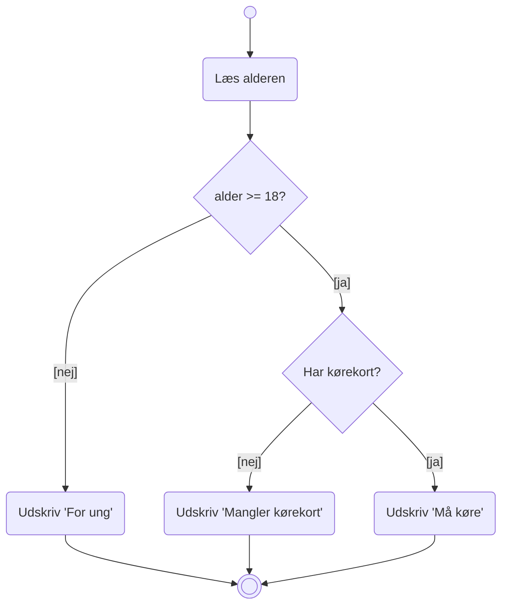

# Opgaver – Aktivitetsdiagram og debugger

Dagens opgaver falder i to dele: **tegne** og **finde fejl**.

Til tegneopgaverne må du bruge papir, [draw.io](https://app.diagrams.net/), Visual Paradigm eller
Mermaid – hvad du har det bedst med. Papir er hurtigst, når man skal prøve sig frem.

> **Arbejd sammen om tegningerne.** Et diagram bliver næsten altid bedre af, at en anden prøver at
> læse det. Byt diagrammer med sidemanden, og se om hun kan følge det uden din forklaring.

---

# Del 1 – Aktivitetsdiagrammer

## Opgave 1 – Fra kode til diagram

Tegn et aktivitetsdiagram for denne kode:

```java
int number = 7;

if (number % 2 == 0) {
    System.out.println("Lige");
}
else {
    System.out.println("Ulige");
}

System.out.println("Færdig");
```

Husk: runde hjørner på actions, diamant på decision, betingelser i kantede parenteser.

## Opgave 2 – Et loop

Tegn et aktivitetsdiagram for:

```java
int i = 1;

while (i <= 10) {

    if (i % 3 == 0) {
        System.out.println(i);
    }

    i++;
}

System.out.println("Slut");
```

Hvor mange decisions er der? Hvor går pilen tilbage til?

## Opgave 3 – Fra diagram til kode

Se på dette diagram:



Skriv koden, der svarer til diagrammet.

## Opgave 4 – Morgenrutine

Tegn et aktivitetsdiagram over din egen morgen, fra du vågner, til du er ude af døren.

Krav:

* mindst tre decisions (fx "er der mælk?", "regner det?", "har jeg tid?")
* hver decision har præcis to udfald
* ingen krydsende linjer
* der er én start og gerne flere slutninger

Byt derefter diagram med sidemanden. Kan hun følge din morgen uden at spørge?

## Opgave 5 – Spiser katten?

> Denne opgave er dagens hovedopgave. Tag jer god tid.

Jeg har en kat, der er meget sulten – og den har selv et meget sindrigt system for at beslutte, om
den har spist op eller ej.

Når den miaver, så miaver den altid **max fem gange**, før den opgiver – men hvis dens ønske bliver
opfyldt inden, så holder den op med at miave. Den miaver meget intenst, så den kan ikke koncentrere
sig om andet imens – det vil sige, at den først tjekker, om der er mad, så miaver, så tjekker igen,
etc. i et lille loop, der altså stopper efter 5 miav.

Her er dens system, som starter, så snart den kommer ud i køkkenet:

* Hvis der er mad i madskålen, så spiser den alt, hvad der er.
* Hvis der ikke var mad i madskålen, så miaver den, indtil skålen bliver fyldt op (dog max fem
  gange).
* Hvis der ikke var mad i madskålen, og den ikke bliver fyldt op, så hopper katten op i
  vindueskarmen.
* Hvis der ikke er plads til at sidde i vindueskarmen, så hopper den ikke op, men miaver igen (fem
  gange).
* Hvis der er plads til at sidde i vindueskarmen, så venter den 5 minutter på, at der kommer mad i
  skålen, før den opgiver og går ud.
* Hvis der ikke var mad i skålen, og ikke plads i vindueskarmen, og ingen reagerer på dens miav, så
  opgiver den og går ud.
* Når den har spist, og skålen dermed er tom, så går den også ud.

> En skål er altid enten tom eller fuld – katten spiser alt, hvad der er i den. I dens verden findes
> der ikke en halvfuld skål.

Det er ikke altid til at vide på forhånd, om der er mad i skålen, plads i vindueskarmen, eller om
der bliver reageret på miaven, så mønsteret er ikke 100 % ens fra gang til gang – men det er oplagt
at lave et aktivitetsdiagram for.

**Tegn et aktivitetsdiagram for katten.** Den slutter altid med at gå ud, men har ikke nødvendigvis
fået noget at spise.

Krav:

* alle decisions har **præcis to udfald**
* **ingen krydsende linjer** – altså: resultatet af én decision må ikke optræde både i A- og
  B-forgreningen
* **færrest mulige gentagelser af actions** – hvis der er én "går udenfor"-action, kan den så bruges
  efter flere forskellige beslutninger?
* brug et timeglas til "vent 5 minutter"

**Arbejd sammen, og gør diagrammet så simpelt som muligt!**

### Ekstra

Kod katten i Java, ud fra dit diagram. Brug `Random` til at afgøre, om der er mad, plads i
vindueskarmen, og om nogen reagerer:

```java
import java.util.Random;

Random random = new Random();

boolean thereIsFood = random.nextBoolean();
```

Kør programmet 20 gange. Får katten mad omtrent så ofte, som du forventede?

## Opgave 6 – Et forløb du kender

Tegn et aktivitetsdiagram for **login på itslearning**, som du oplever det:

* du åbner siden
* du vælger EK-login
* enten er du allerede logget på Microsoft, eller også skal du indtaste brugernavn og kodeord
* måske skal du godkende på din telefon
* måske indtaster du forkert kodeord og skal prøve igen (max tre gange)
* til sidst er du enten inde eller låst ude

Brug et **signal** (flag) til de steder, hvor brugeren gør noget.

---

# Del 2 – Debuggeren

For hver af de følgende opgaver:

1. **Skriv først ned, hvad du forventer**, programmet gør
2. Kør det, og se hvad der faktisk sker
3. **Find fejlen med debuggeren** – ikke ved at stirre på koden
4. Ret fejlen

## Opgave 7 – Kom i gang

Skriv dette program af:

```java
public class Main {

    public static void main(String[] args) {

        int a = 5;
        int b = 10;
        int sum = a + b;
        int product = a * b;

        System.out.println(sum);
        System.out.println(product);
    }
}
```

1. Sæt et breakpoint på linjen `int sum = a + b;`
2. Start i debug-tilstand med 🐞
3. Tryk <kbd>F8</kbd> (Step Over) én linje ad gangen
4. Hold øje med **Variables**. Hvornår dukker `sum` op? Hvornår dukker `product` op?
5. Hvorfor findes `product` ikke fra starten?

## Opgave 8 – Summen der ikke bliver til noget

```java
int[] numbers = {5, 10, 15, 20};
int sum = 0;

for (int i = 0; i < numbers.length; i++) {
    sum = numbers[i];
}

System.out.println("Summen er " + sum);
```

1. Hvad forventer du?
2. Hvad sker der?
3. Sæt et breakpoint inde i loopet, og tryk <kbd>F9</kbd> fire gange. Følg `sum` og `i`.
4. Hvad er fejlen?

## Opgave 9 – Off by one

```java
String text = "Java";

for (int i = 0; i <= text.length(); i++) {
    System.out.println(text.charAt(i));
}
```

1. Programmet crasher. Hvilken exception får du?
2. Sæt et breakpoint i loopet. Hvad er `i`, når det går galt?
3. Hvad er `text.length()`?
4. Ret fejlen.

## Opgave 10 – Evaluate Expression

```java
int[] grades = {12, 7, 4, 10, 2};
int sum = 0;

for (int i = 0; i < grades.length; i++) {
    sum += grades[i];
}

double average = sum / grades.length;

System.out.println("Gennemsnit: " + average);
```

1. Gennemsnittet bliver `7.0`. Men det rigtige svar er `7.0`... eller er det?
   Regn det ud i hånden først.
2. Sæt et breakpoint på linjen med `average`.
3. Åbn **Evaluate Expression** (<kbd>Alt</kbd>+<kbd>F8</kbd>), og prøv:
   * `sum`
   * `grades.length`
   * `sum / grades.length`
   * `(double) sum / grades.length`
4. Hvad er forskellen på de to sidste? Hvad hedder fejlen?
5. Ret koden.

## Opgave 11 – Step Into

```java
public class Main {

    public static void main(String[] args) {
        int result = calculate(4, 3);
        System.out.println(result);
    }

    public static int calculate(int a, int b) {
        int doubled = doubleIt(a);
        return doubled + b;
    }

    public static int doubleIt(int number) {
        return number * number;
    }
}
```

1. Programmet skriver `19`, men skulle skrive `11`. Hvor er fejlen?
2. Sæt et breakpoint på `int result = calculate(4, 3);`
3. Tryk <kbd>F7</kbd> (Step Into) for at hoppe ind i `calculate`
4. Tryk <kbd>F7</kbd> igen for at hoppe ind i `doubleIt`
5. Hvad er `number`, og hvad returneres?
6. Ret fejlen.
7. Prøv opgaven igen med <kbd>F8</kbd> i stedet for <kbd>F7</kbd>. Hvad er forskellen?

## Opgave 12 – Betinget breakpoint

```java
int[] numbers = new int[1000];

for (int i = 0; i < numbers.length; i++) {
    numbers[i] = i * 2;
}

numbers[743] = -1;

int sum = 0;

for (int i = 0; i < numbers.length; i++) {
    sum += numbers[i];
}

System.out.println(sum);
```

1. Sæt et breakpoint i det andet loop
2. **Højreklik** på breakpointet, og sæt betingelsen `numbers[i] < 0`
3. Kør i debug-tilstand
4. Hvad er `i`, når programmet stopper?

Prøv derefter uden betingelsen. Hvor mange gange skulle du trykke <kbd>F9</kbd>?

## Opgave 13 – Find fejlen selv

Her er et program, der skal finde det største tal i et array. Det virker ikke altid.

```java
public class Main {

    public static void main(String[] args) {

        int[] numbers = {-5, -12, -3, -20};

        int max = 0;

        for (int i = 0; i < numbers.length; i++) {

            if (numbers[i] > max) {
                max = numbers[i];
            }
        }

        System.out.println("Største: " + max);
    }
}
```

1. Kør programmet. Hvad skriver det?
2. Er det rigtigt?
3. Prøv med `{5, 12, 3, 20}` i stedet. Virker det nu?
4. Brug debuggeren til at finde ud af, hvorfor det går galt i det første tilfælde
5. Ret fejlen

> Denne slags fejl er de farligste: programmet crasher ikke, det giver bare et forkert svar. Det er
> derfor, man tester med mere end ét sæt data.

## Opgave 14 – Debug dit eget

Find et program, du selv har skrevet tidligere i denne uge – gerne et fra
[bogsamlingsprojektet](../../projekter/bogsamling/readme.md).

1. Sæt et breakpoint et sted midt i det
2. Kør i debug-tilstand
3. Fold et objekt ud i **Variables**, og kig på dets attributter
4. Prøv **Evaluate Expression** på en af dine egne metoder

---

## Udfordring 1 – Diagram over noget, du har kodet

Tag et program, du selv har skrevet – gerne `findBookByTitle` eller `printUnreadBooks` fra
bogsamlingen.

Tegn aktivitetsdiagrammet **bagefter**, ud fra koden.

Diskutér i gruppen: Ville du have skrevet koden anderledes, hvis du havde tegnet først?

## Udfordring 2 – Attack-sekvensen

Kig frem på [Adventure del 5](../../projekter/adventure/del-5-enemies.md), og læs afsnittet om
attack-sekvensen.

Prøv at tegne et aktivitetsdiagram for den – bare et første forsøg.

Du kommer til at lave den rigtige version om tre uger. Men prøv nu, mens du har notationen frisk i
hovedet, og gem tegningen. Det bliver interessant at se, hvor meget du har flyttet dig.
