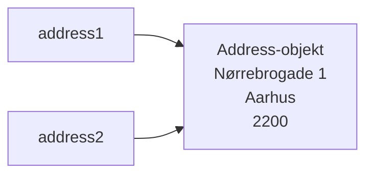
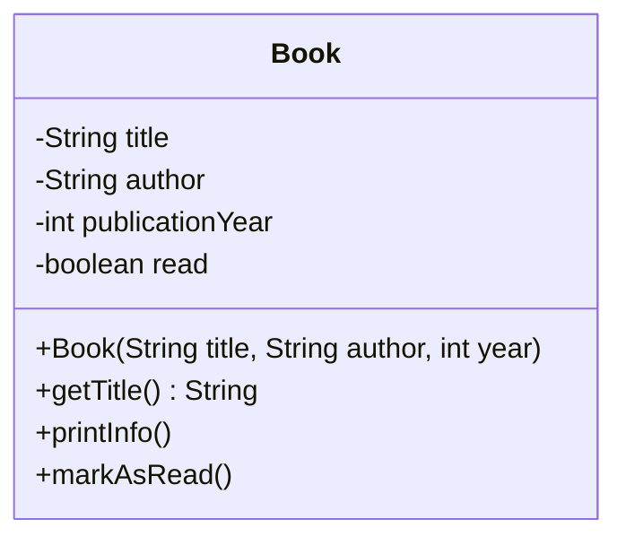
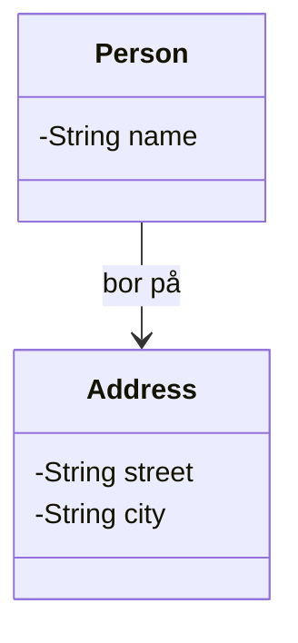
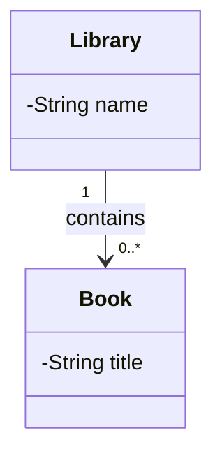
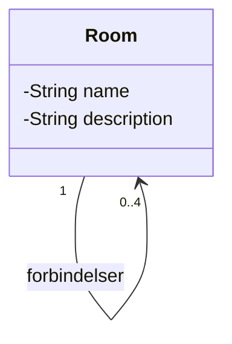
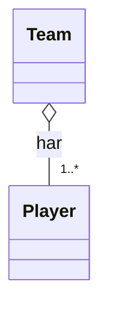
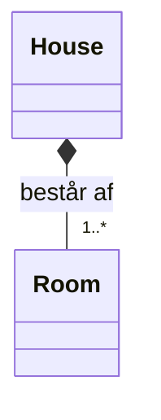
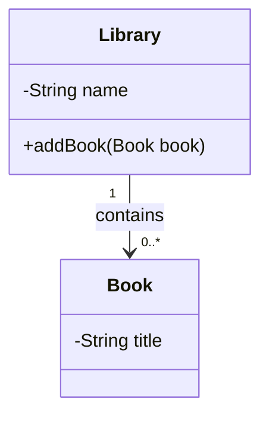

# Objekter i objekter. Klassediagrammer

## Beskrivelse

Indtil nu har vores objekter indeholdt tal og tekst. I dag lader vi dem indeholde **hinanden**.

Et `Library` har nogle `Book`-objekter. En `Car` har en `Engine`. Et `Room` har nogle `Item`-objekter
og fire naboer, som også er `Room`. Det er sådan, rigtige programmer er bygget: som et netværk af
objekter, der kender hinanden.

Vi lærer også at **tegne** det. Et klassediagram viser, hvilke klasser der findes, og hvordan de
hænger sammen – uden at man skal læse en linje kode.

## Læringsmål

Når du har arbejdet med dagens materiale, skal du kunne:

* lade en klasse have en attribut, hvis type er en anden klasse
* forklare hvad en **objektreference** er, og at flere variable kan pege på det samme objekt
* forklare hvad `null` betyder for en objektreference
* lave et **array af objekter** og løbe det igennem
* tegne et klassediagram med klasser, attributter og metoder
* tegne en **association** mellem to klasser og sætte **multiplicitet** på
* kende forskel på **aggregation** og **komposition**
* forklare hvorfor `==` og `.equals()` ikke er det samme for objekter

## Se disse videoer før undervisningen:

[array of objects](https://www.youtube.com/watch?v=xTtL8E4LzTQ&list=PLEeqf0uSZqXsz7oU2U-VAxhQZ021PRVnd&t=7h8m22s) (til: 07:14:07)
[aggregation](https://www.youtube.com/watch?v=xTtL8E4LzTQ&list=PLEeqf0uSZqXsz7oU2U-VAxhQZ021PRVnd&t=8h29m39s) (til: 08:39:02)
[composition](https://www.youtube.com/watch?v=xTtL8E4LzTQ&list=PLEeqf0uSZqXsz7oU2U-VAxhQZ021PRVnd&t=8h39m2s) (til: 08:45:17)

## Læs nedenstående før undervisningen

---

# Del 1: Objekter i objekter


## En attribut kan være et objekt

Du har allerede skrevet klasser med attributter som `int`, `String` og `boolean`:

```java
public class Book {
    private String title;
    private String author;
    private int publicationYear;
}
```

En attribut kan lige så godt have en klasse som type:

```java
public class Person {
    private String name;
    private Address address;      // ← en anden klasse
}
```

```java
public class Address {
    private String street;
    private String city;
    private String postalCode;
}
```

Nu **har** en `Person` en `Address`. Vi siger, at der er en **has-a**-relation mellem dem.

Sådan bruges det:

```java
Address address = new Address("Nørrebrogade 1", "København", "2200");
Person person = new Person("Anna", address);
```

eller i ét hug:

```java
Person person = new Person("Anna", new Address("Nørrebrogade 1", "København", "2200"));
```

---

## Hvad ligger der egentlig i variablen?

Det her er den vigtigste pointe i dag, og den kommer igen hele semesteret.

For en primitiv type ligger **værdien** i variablen:

```java
int a = 5;
int b = a;      // b får en KOPI af værdien

b = 10;

System.out.println(a);      // 5 – a er uændret
```

For et objekt ligger **en reference** i variablen – altså en henvisning til, hvor objektet er:

```java
Address address1 = new Address("Nørrebrogade 1", "København", "2200");
Address address2 = address1;      // address2 peger på det SAMME objekt

address2.setCity("Aarhus");

System.out.println(address1.getCity());     // Aarhus!
```

Der er kun **ét** Address-objekt. To variable peger bare på det.



> **Det er præcis dette princip, hele [Adventure-projektet](../../projekter/adventure/readme.md)
> bygger på.** Et `Room` har fire attributter af typen `Room`. Der ligger ikke fire rum inde i
> rummet – der ligger fire *henvisninger* til rum, der findes andre steder. Og når `room1.east`
> peger på `room2`, og `room2.west` peger på `room1`, er det de samme to objekter set fra hver sin
> side.

## `null` – ingen reference

En objektreference kan være `null`, som betyder "peger ikke på noget":

```java
Person person = new Person("Anna");     // ingen adresse endnu

System.out.println(person.getAddress());        // null
System.out.println(person.getAddress().getCity());   // ← crash!
```

Den sidste linje giver:

```text
Exception in thread "main" java.lang.NullPointerException
```

Det er den hyppigste fejl i Java overhovedet. Den betyder altid det samme: **du kaldte en metode
på noget, der ikke var der.**

Tjek for `null`, når du er i tvivl:

```java
if (person.getAddress() != null) {
    System.out.println(person.getAddress().getCity());
}
else {
    System.out.println("Ingen adresse registreret");
}
```

## `==` og `.equals()` for objekter

Nu kan vi forklare det, vi kun fik at vide som en regel den 4. september:

```java
Address a = new Address("Nørrebrogade 1", "København", "2200");
Address b = new Address("Nørrebrogade 1", "København", "2200");

System.out.println(a == b);          // false!
```

De to objekter har fuldstændig samme indhold – men det er **to forskellige objekter**. `==`
sammenligner referencerne, altså om det er den samme kasse i hukommelsen.

```java
Address c = a;

System.out.println(a == c);          // true – samme objekt
```

Vil du sammenligne **indhold**, skal klassen have en `equals`-metode. `String` har allerede én –
det er derfor, vi bruger `.equals()` til tekst.

> Vi skriver ikke vores egne `equals`-metoder endnu. Men nu ved du, hvorfor reglen findes.

---

## Array af objekter

Et array kan indeholde objekter lige så godt som tal:

```java
Book[] books = new Book[3];

books[0] = new Book("The Hobbit", "Tolkien", 1937);
books[1] = new Book("1984", "Orwell", 1949);
books[2] = new Book("Dune", "Herbert", 1965);

for (int i = 0; i < books.length; i++) {
    books[i].printInfo();
}
```

**Pas på:** Denne linje opretter **ingen** bøger:

```java
Book[] books = new Book[3];
```

Den opretter et array med plads til tre bogreferencer – og alle tre er `null` til at starte med.
Objekterne skal oprettes hver for sig.

Prøver du at bruge en plads, du ikke har fyldt:

```java
Book[] books = new Book[3];

books[0].printInfo();      // ← NullPointerException
```

Man kan også oprette dem med det samme:

```java
Book[] books = {
    new Book("The Hobbit", "Tolkien", 1937),
    new Book("1984", "Orwell", 1949),
    new Book("Dune", "Herbert", 1965)
};
```

### Søg blandt objekter

Søgemønsteret fra tidligere virker også her:

```java
public static Book findByTitle(Book[] books, String title) {

    for (int i = 0; i < books.length; i++) {

        if (books[i].getTitle().equals(title)) {
            return books[i];
        }
    }

    return null;      // ikke fundet
}
```

Bemærk to ting:

* Vi returnerer `null`, når der ikke blev fundet noget – ligesom `indexOf` returnerer `-1`.
* Vi sammenligner titlerne med `.equals()`, ikke `==`.

Og hos kalderen:

```java
Book found = findByTitle(books, "Dune");

if (found != null) {
    found.printInfo();
}
else {
    System.out.println("Bogen blev ikke fundet");
}
```

> I morgen lærer I `ArrayList`, som gør det hele nemmere – man behøver ikke bestemme størrelsen på
> forhånd. Men princippet er det samme.

---

# Del 2: Klassediagrammer

## Hvad er et klassediagram?

Et klassediagram er UML's måde at vise **strukturen** i et program: hvilke klasser der findes, hvad
de indeholder, og hvordan de hænger sammen.

Hvor aktivitetsdiagrammet viste et **forløb** (hvad der sker), viser klassediagrammet en
**struktur** (hvad der findes).

## En klasse

En klasse tegnes som en kasse med tre rum:



* Øverst: **navnet**
* I midten: **attributterne**
* Nederst: **metoderne**

### Synlighed

| Tegn | Betyder |
| --- | --- |
| `-` | `private` |
| `+` | `public` |
| `#` | `protected` |

Attributter er næsten altid `private` (`-`), og metoder næsten altid `public` (`+`).

### Skrivemåde

Attributter skrives typisk:

```text
- navn: type
```

og metoder:

```text
+ navn(parameter: type): returtype
```

Du vil se små variationer i notationen forskellige steder. Det vigtigste er, at du er **konsekvent**
i det samme diagram.

---

## Association – klasser der kender hinanden

Når en klasse har en attribut af en anden klasses type, tegnes en **association**: en streg mellem
de to kasser.



Pilen viser **retningen**: `Person` kender `Address`, men `Address` kender ikke `Person`.

Kender de hinanden begge veje, tegnes en streg uden pil.

## Multiplicitet – hvor mange?

Tallene ved enderne af stregen siger, hvor mange objekter der er med i relationen:

| Notation | Betyder |
| --- | --- |
| `1` | præcis én |
| `0..1` | nul eller én |
| `*` eller `0..*` | nul eller flere |
| `1..*` | mindst én |
| `0..4` | mellem nul og fire |



Læses som: **ét** `Library` indeholder **nul eller flere** `Book`.

Og fra Adventure:



Et `Room` har mellem nul og fire naboer – som også er `Room`. En klasse må gerne have en relation
til sig selv.

---

## Aggregation og komposition

Der er to særlige slags "has-a", og de har hver sit symbol.

### Aggregation – "har en, men ejer den ikke"

Tegnes med en **hul rombe** ◇ i den ende, der "har".

Delene kan eksistere uden helheden. Sletter du helheden, findes delene stadig.



Et fodboldhold har spillere. Nedlægges holdet, findes spillerne stadig – de kan skifte til et andet
hold.

### Komposition – "består af, og ejer den"

Tegnes med en **udfyldt rombe** ◆.

Delene kan ikke eksistere uden helheden. Sletter du helheden, forsvinder delene.



Et hus består af rum. River du huset ned, findes rummene ikke længere.

### Hvordan ser det ud i kode?

Forskellen ligger ofte i, **hvem der opretter objektet**.

**Aggregation** – objektet kommer udefra:

```java
public class Team {
    private Player[] players;

    public Team(Player[] players) {
        this.players = players;      // får dem udefra
    }
}
```

**Komposition** – objektet oprettes indeni:

```java
public class House {
    private Room[] rooms;

    public House() {
        this.rooms = new Room[5];
        for (int i = 0; i < rooms.length; i++) {
            rooms[i] = new Room();   // opretter dem selv
        }
    }
}
```

> Vær ikke bange for at tage fejl her. Grænsen mellem aggregation og komposition er en
> **designbeslutning**, ikke en naturlov, og erfarne udviklere er ofte uenige. Det vigtigste er, at
> du kan **forklare dit valg**.
>
> Er du i tvivl, så brug en almindelig association (bare en streg). Det er aldrig forkert.

---

## Hvad skal med i diagrammet?

Et klassediagram er en **kommunikation**, ikke en kopi af koden. Tag det med, der hjælper læseren:

**Tag med:**

* alle klasser
* de vigtige attributter
* de metoder, andre klasser kalder
* relationerne, med multiplicitet

**Udelad gerne:**

* alle gettere og settere (de fylder og siger ikke noget)
* `main`
* private hjælpemetoder, der kun bruges internt

> **Vigtigt:** Diagrammet skal **tegnes**, ikke autogenereres fra IntelliJ. Et autogenereret diagram
> tager alt med og viser dermed ingenting. Pointen med at tegne er, at du selv skal beslutte, hvad
> der er væsentligt.
>
> Dette krav går igen i [Adventure del 1 – refactor](../../projekter/adventure/del-1-refactor.md)
> og [del 5](../../projekter/adventure/del-5-enemies.md).

---

## Værktøjer

| Værktøj | Bemærkning |
| --- | --- |
| Papir og blyant | Hurtigst når man prøver sig frem |
| [draw.io](https://app.diagrams.net/) | Gratis, kører i browseren, har UML-figurer |
| [Visual Paradigm](https://www.visual-paradigm.com/) | Rigtigt UML-værktøj |
| [Mermaid](https://mermaid.js.org/syntax/classDiagram.html) | Tekst der bliver til diagram – renderer direkte på GitHub |

Mermaid er værd at kunne, fordi diagrammet kan ligge sammen med koden og rettes som tekst. Sådan
ser det ud:

````text

````

---

### Kan du forudsige resultatet?

#### Eksempel 1

```java
int a = 5;
int b = a;
b = 10;

System.out.println(a);
```

#### Eksempel 2

```java
Book book1 = new Book("Dune", "Herbert", 1965);
Book book2 = book1;

book2.setTitle("The Hobbit");

System.out.println(book1.getTitle());
```

> Hvorfor er svaret forskelligt fra eksempel 1?

#### Eksempel 3

```java
Book a = new Book("Dune", "Herbert", 1965);
Book b = new Book("Dune", "Herbert", 1965);

System.out.println(a == b);
```

#### Eksempel 4

```java
Book[] books = new Book[3];

System.out.println(books.length);
System.out.println(books[0]);
books[0].printInfo();
```

> Hvad går galt på sidste linje, og hvad hedder fejlen?

#### Eksempel 5

Tegn klassediagrammet for denne kode:

```java
public class Car {
    private String model;
    private Engine engine;
    private Wheel[] wheels;      // altid 4
}

public class Engine {
    private int horsePower;
}

public class Wheel {
    private int size;
}
```

Overvej: er `Engine` aggregation eller komposition? Hvad med `Wheel`?

---

## Det vigtigste at tage med

**Objekter i objekter**

* en attribut kan have en klasse som type – det er en **has-a**-relation
* en objektvariabel indeholder en **reference**, ikke objektet selv
* to variable kan pege på det samme objekt – ændrer du via den ene, ser du det via den anden
* `null` betyder "peger ikke på noget"; kalder du en metode på `null`, får du en
  `NullPointerException`
* `new Book[3]` opretter **ingen** bøger, kun tre tomme pladser
* `==` sammenligner referencer, ikke indhold

**Klassediagram**

* tre rum i kassen: navn, attributter, metoder
* `-` = private, `+` = public
* association = streg; pilen viser hvem der kender hvem
* multiplicitet: `1`, `0..1`, `0..*`, `1..*`, `0..4`
* hul rombe ◇ = aggregation, udfyldt rombe ◆ = komposition
* tag det med, der hjælper læseren – og **tegn**, autogenerér ikke

## Aktiviteter i undervisningen

Arbejd med disse [opgaver](opgaver.md)
