# Vejledende løsninger – Objekter i objekter. Klassediagrammer

Her er vejledende løsninger til [opgaverne](opgaver.md). Al kode er kompileret og kørt, og det
output, der står, er det, programmerne faktisk giver.

> **Vejledende** betyder: din kode og dine diagrammer må gerne se anderledes ud. Det vigtige er, at
> du kan forklare, *hvorfor* det virker – især hvad der ligger i en variabel, og hvornår to variable
> peger på det samme objekt.

Tegningerne af hukommelsen er lavet i Mermaid, så GitHub kan vise dem. På papir tegner du det samme:
**stakken** til venstre med variablerne, **heapen** til højre med objekterne, og pile fra variabel til
objekt.

---

## Sådan læser du tegningerne: stack og heap

Java deler hukommelsen i to dele, som du skal kende:

* **Stakken (the stack).** Hver gang en metode kaldes, får den et **stack frame** – en kasse med
  plads til metodens lokale variable og parametre. Når metoden er færdig, smides kassen væk igen.
  I opgaverne her er der kun ét frame: det, der hører til `main`.
* **Heapen (the heap).** Her ligger alle objekter. Hver gang du skriver `new`, oprettes der et nyt
  objekt på heapen. Objektet bliver liggende, så længe der er mindst én reference, der peger på det.

Det afgørende er, **hvad der ligger i variablen** i stack framet:

| Variablens type | Hvad der ligger i variablen | Hvor værdien bor |
| --- | --- | --- |
| primitiv (`int`, `double`, `boolean`, …) | selve værdien, fx `5` | i stack framet |
| objekt (`Counter`, `String`, `Book[]`, …) | en **reference** – en pil til objektet | objektet bor på heapen |

En tildeling `b = a` kopierer altid **det, der ligger i variablen**. For en `int` er det tallet. For
et objekt er det pilen – og så peger to variable på det samme objekt.

---

# Del 1 – Referencer

## Opgave 1 – Primitiv eller reference?

### a

```text
a = 5
b = 10
```

`int b = a` kopierer **værdien** 5 ind i `b`. Derefter er `a` og `b` to helt uafhængige kasser i
stack framet. `b = 10` ændrer kun `b`.

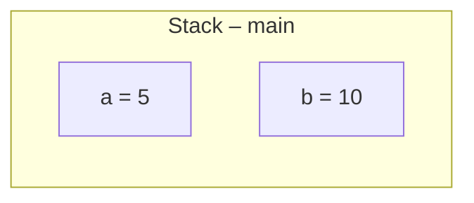

### b

```text
c1.value = 10
c2.value = 10
```

`Counter c2 = c1` kopierer **referencen** – pilen – ikke objektet. Der er stadig kun **ét**
`Counter`-objekt, og både `c1` og `c2` peger på det. Når `c2.value = 10` ændrer objektet, ser man
det også gennem `c1`, for det er det samme objekt.

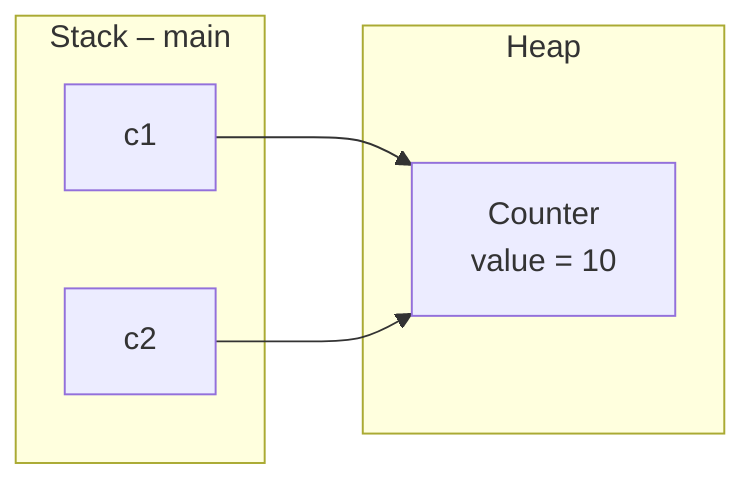

**Hvorfor forskellen?** Fordi `int` er en primitiv type, og `Counter` er en klasse. En variabel af
en primitiv type *indeholder* værdien. En variabel af en klassetype indeholder en *henvisning* til
et objekt, der ligger et andet sted. `=` kopierer det, der er i variablen – og det er noget
forskelligt i de to tilfælde.

---

## Opgave 2 – Tegn hukommelsen

Vi tegner efter hver linje. `main` har ét stack frame med plads til `c1`, `c2` og `c3`.

**Linje 1:** `Counter c1 = new Counter();`

`new` opretter et `Counter`-objekt på heapen med `value = 0`. Referencen til det gemmes i `c1`.

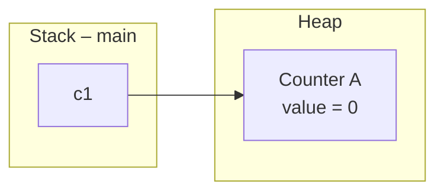

**Linje 2:** `Counter c2 = new Counter();`

Endnu et `new`, altså endnu et objekt. `c2` peger på det nye.

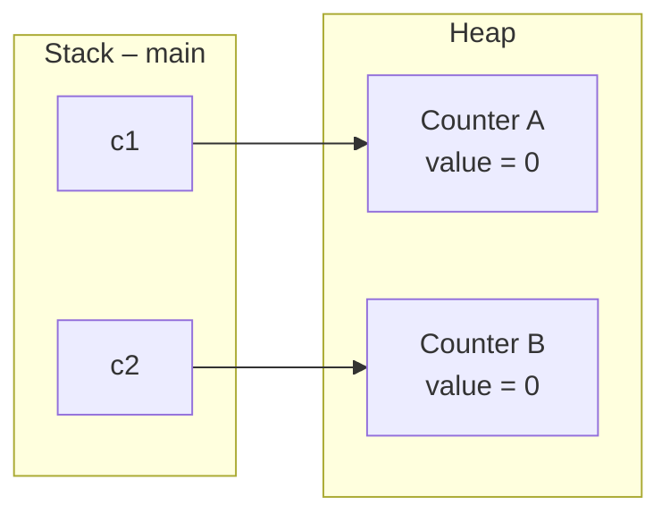

**Linje 3:** `Counter c3 = c1;`

Der står **ikke** `new` – så der oprettes ikke noget objekt. `c3` får en kopi af pilen i `c1`, og
peger derfor på objekt A.

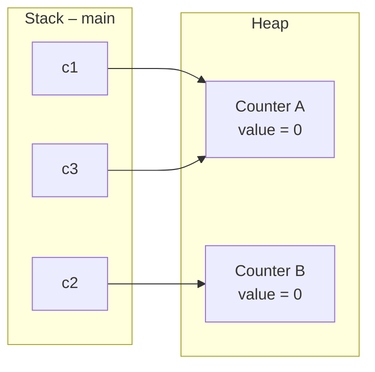

**Linje 4-6:** de tre tildelinger ændrer ikke på pilene – de ændrer *inde i* objekterne:

| Linje | Følger pilen fra | … til objekt | Objektet bagefter |
| --- | --- | --- | --- |
| `c1.value = 5;` | `c1` | A | A: `value = 5`, B: `value = 0` |
| `c2.value = 10;` | `c2` | B | A: `value = 5`, B: `value = 10` |
| `c3.value = 20;` | `c3` | A | A: `value = 20`, B: `value = 10` |

Den sidste linje **overskriver** det 5-tal, `c1` satte, fordi `c3` og `c1` er den samme kasse set
fra to variable.

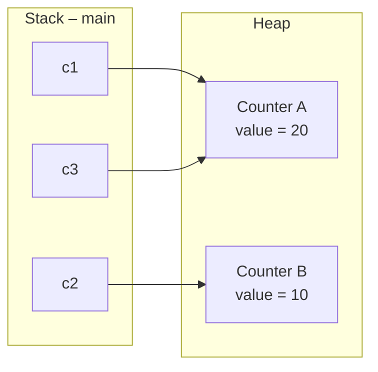

**Til sidst:**

```text
c1.value = 20
c2.value = 10
c3.value = 20
```

**Hvor mange `Counter`-objekter blev der oprettet?** To. Tæl antallet af `new` – det er altid
svaret. Der er tre variable, men kun to objekter.

> Tommelfingerregel: **`new` = ny kasse på heapen. `=` uden `new` = en pil mere til en kasse, der
> allerede findes.**

---

## Opgave 3 – NullPointerException

```java
Counter c = null;

System.out.println(c);          // udskriver: null
System.out.println(c.value);    // crasher
```

```text
null
Exception in thread "main" java.lang.NullPointerException: Cannot read field "value" because "c" is null
```

1. **Første linje** udskriver teksten `null`. **Anden linje** crasher med en
   `NullPointerException`.
2. Den første linje virker, fordi `println` *får referencen* som parameter og selv tjekker, om den
   er `null` – og i så fald skriver teksten `"null"`. Den anden linje skal **følge pilen** for at
   finde `value` inde i objektet. Men der er ingen pil at følge, for `c` peger ikke på noget.
   Det er det, `NullPointerException` betyder: *du prøvede at følge en pil, der ikke er der.*

   Læg mærke til fejlbeskeden: Java fortæller både *hvad* den ville læse (`value`) og *hvorfor* det
   ikke gik (`"c" is null`). Læs den – den peger næsten altid direkte på fejlen.

3. Med et `if`:

```java
Counter c = null;

System.out.println(c);

if (c != null) {
    System.out.println(c.value);
}
else {
    System.out.println("c peger ikke på noget");
}
```

```text
null
c peger ikke på noget
```

---

## Opgave 4 – == og equals

```text
true
false
true
```

Det overrasker de fleste, at den første linje er `true`, når nu `==` sammenligner referencer.
Forklaringen er en optimering i Java:

* **`a == b` er `true`.** Tekst skrevet direkte i koden (`"hello"`) kaldes en *literal*. Java
  gemmer alle literals ét sted (*string pool*), og to ens literals bliver til det **samme** objekt.
  Så `a` og `b` peger på den samme kasse.
* **`a == c` er `false`.** `new String("hello")` opretter – som alt andet med `new` – et **nyt**
  objekt på heapen. Indholdet er det samme, men det er en anden kasse, og `==` sammenligner kun
  pilene.
* **`a.equals(c)` er `true`.** `equals` sammenligner **indholdet**, bogstav for bogstav.

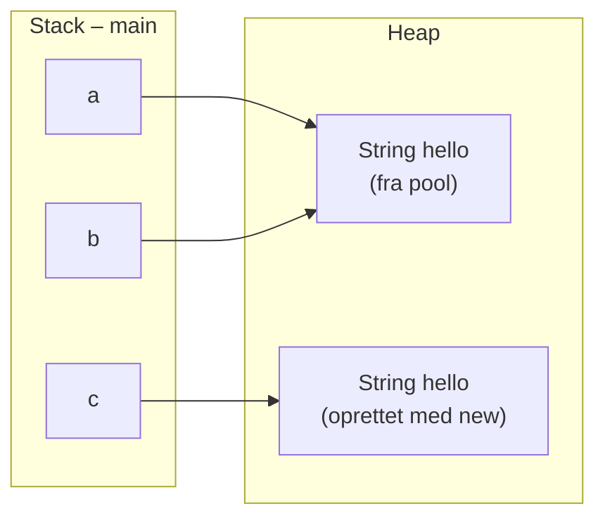

**Konklusion:** `==` på strenge virker *nogle gange* – og det er værre end aldrig, for så virker
det i testen og fejler, når teksten kommer fra `Scanner` eller en fil. Brug altid `.equals()` til
tekst. Nu ved du hvorfor.

---

# Del 2 – Objekter i objekter

## Opgave 5 – Person og Address

```java
public class Address {

    private String street;
    private String city;
    private String postalCode;

    public Address(String street, String city, String postalCode) {
        this.street = street;
        this.city = city;
        this.postalCode = postalCode;
    }

    public String getStreet() {
        return street;
    }

    public String getCity() {
        return city;
    }

    public String getPostalCode() {
        return postalCode;
    }
}
```

```java
public class Person {

    private String name;
    private Address address;

    public Person(String name, Address address) {
        this.name = name;
        this.address = address;
    }

    public String getName() {
        return name;
    }

    public Address getAddress() {
        return address;
    }

    public void printInfo() {
        System.out.println(name);
        System.out.println(address.getStreet());
        System.out.println(address.getPostalCode() + " " + address.getCity());
    }
}
```

```java
public class Main {

    public static void main(String[] args) {

        Address address = new Address("Nørrebrogade 1", "København", "2200");
        Person person = new Person("Anna", address);

        person.printInfo();
    }
}
```

```text
Anna
Nørrebrogade 1
2200 København
```

Bemærk, at `Person` ikke selv kender gade og by. Den kender kun *sin adresse* og spørger den:
`address.getStreet()`. Det er has-a i praksis.

---

## Opgave 6 – Delt adresse

`Address` skal have en setter, for at man kan ændre byen:

```java
public void setCity(String city) {
    this.city = city;
}
```

```java
public class Main {

    public static void main(String[] args) {

        Address shared = new Address("Nørrebrogade 1", "København", "2200");

        Person anna = new Person("Anna", shared);
        Person bo = new Person("Bo", shared);

        anna.printInfo();
        bo.printInfo();

        anna.getAddress().setCity("Aarhus");

        System.out.println("--- efter ændring ---");
        anna.printInfo();
        bo.printInfo();
    }
}
```

```text
Anna
Nørrebrogade 1
2200 København
Bo
Nørrebrogade 1
2200 København
--- efter ændring ---
Anna
Nørrebrogade 1
2200 Aarhus
Bo
Nørrebrogade 1
2200 Aarhus
```

**Hvad skete der?** Bo flyttede også til Aarhus, selvom vi kun ændrede "via Anna". Der er kun ét
`Address`-objekt, og begge personer har en pil til det:

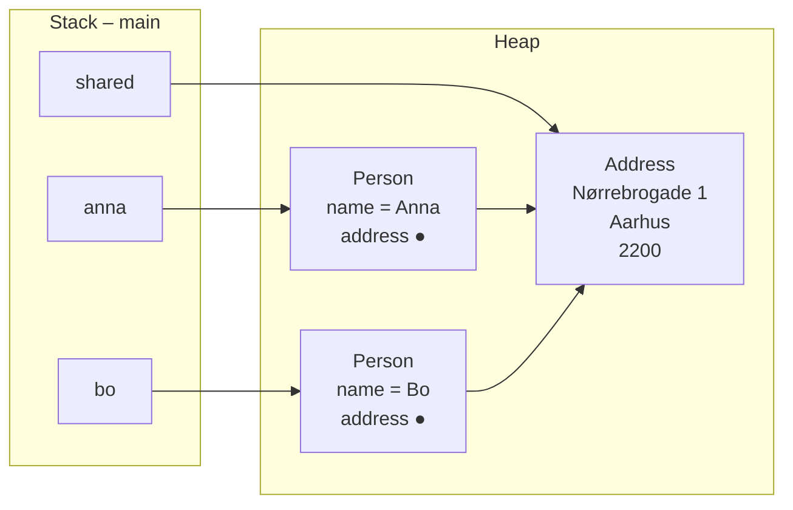

**Fordel eller fælde?** Begge dele:

* **Fordel**, når det *skal* være den samme adresse. Anna og Bo bor sammen – flytter de, skal
  adressen kun rettes ét sted. Det er præcis det, Adventure bruger: to rum, der peger på hinanden,
  er de samme to objekter set fra hver sin side.
* **Fælde**, når man *tror*, man har en kopi. Skulle Bo flytte alene, og man skriver
  `bo.getAddress().setCity("Aarhus")`, flytter Anna med – og den fejl er svær at finde, fordi
  koden ser rigtig ud. Løsningen er at give Bo sit eget `Address`-objekt med `new`.

---

## Opgave 7 – Ingen adresse

Man kan have flere constructors i samme klasse, så længe de tager forskellige parametre. Det
kaldes *overloading*.

```java
public class Person {

    private String name;
    private Address address;

    public Person(String name, Address address) {
        this.name = name;
        this.address = address;
    }

    public Person(String name) {
        this.name = name;
        this.address = null;      // kan udelades – null er standardværdien for objektreferencer
    }

    public String getName() {
        return name;
    }

    public Address getAddress() {
        return address;
    }

    public void printInfo() {
        System.out.println(name);

        if (address != null) {
            System.out.println(address.getStreet());
            System.out.println(address.getPostalCode() + " " + address.getCity());
        }
        else {
            System.out.println("(ingen adresse registreret)");
        }
    }
}
```

```java
Person anna = new Person("Anna");
anna.printInfo();

Person bo = new Person("Bo", new Address("Nørrebrogade 1", "København", "2200"));
bo.printInfo();
```

```text
Anna
(ingen adresse registreret)
Bo
Nørrebrogade 1
2200 København
```

Pointen er, at `null`-tjekket ligger **inde i `Person`**. Den, der kalder `printInfo()`, skal ikke
vide, om der er en adresse eller ej – det er `Person`s ansvar at håndtere det.

---

## Opgave 8 – Bil, motor og hjul

```java
public class Engine {

    private int horsePower;
    private String fuelType;

    public Engine(int horsePower, String fuelType) {
        this.horsePower = horsePower;
        this.fuelType = fuelType;
    }

    public int getHorsePower() {
        return horsePower;
    }

    public String getFuelType() {
        return fuelType;
    }
}
```

```java
public class Wheel {

    private int size;

    public Wheel(int size) {
        this.size = size;
    }

    public int getSize() {
        return size;
    }
}
```

```java
public class Car {

    private String model;
    private Engine engine;
    private Wheel[] wheels;

    public Car(String model, Engine engine, int wheelSize) {
        this.model = model;
        this.engine = engine;              // motoren kommer udefra

        this.wheels = new Wheel[4];        // hjulene laver bilen selv
        for (int i = 0; i < wheels.length; i++) {
            wheels[i] = new Wheel(wheelSize);
        }
    }

    public void printInfo() {
        System.out.println("Model: " + model);
        System.out.println("Motor: " + engine.getHorsePower() + " hk (" + engine.getFuelType() + ")");
        System.out.println("Hjul: " + wheels.length + " stk, " + wheels[0].getSize() + " tommer");
    }
}
```

```java
Engine engine = new Engine(150, "benzin");
Car car = new Car("Toyota Corolla", engine, 16);

car.printInfo();
```

```text
Model: Toyota Corolla
Motor: 150 hk (benzin)
Hjul: 4 stk, 16 tommer
```

**Aggregation eller komposition?**

* **`Engine` er aggregation.** Motoren oprettes *uden for* bilen og gives til den. Den findes, før
  bilen findes, og den kunne i princippet sættes i en anden bil. Bilen *har* en motor, men *ejer*
  den ikke.
* **`Wheel` er komposition.** Hjulene oprettes *inde i* `Car`s constructor. Ingen andre har en
  reference til dem – forsvinder bilen, forsvinder hjulene. Bilen *består af* fire hjul.

Man kan diskutere det (hjul kan jo også skiftes), og det er fint. Det vigtige er begrundelsen:
**hvem opretter objektet, og kan det leve videre uden helheden?**

---

# Del 3 – Array af objekter

## Opgave 9 – Et array af bøger

En simpel `Book` til dagens opgaver:

```java
public class Book {

    private String title;
    private String author;
    private int publicationYear;

    public Book(String title, String author, int publicationYear) {
        this.title = title;
        this.author = author;
        this.publicationYear = publicationYear;
    }

    public String getTitle() {
        return title;
    }

    public String getAuthor() {
        return author;
    }

    public int getPublicationYear() {
        return publicationYear;
    }

    public void printInfo() {
        System.out.println(title + " (" + author + ", " + publicationYear + ")");
    }
}
```

```java
public class Main {

    public static void main(String[] args) {

        Book[] books = new Book[5];                      // 1

        System.out.println(books.length);                // 2
        System.out.println(books[0]);                    // 3

        // books[0].getTitle();                          // 4 – NullPointerException

        books[0] = new Book("The Hobbit", "Tolkien", 1937);      // 5
        books[1] = new Book("1984", "Orwell", 1949);
        books[2] = new Book("Dune", "Herbert", 1965);

        for (int i = 0; i < books.length; i++) {         // 6
            if (books[i] != null) {
                books[i].printInfo();
            }
        }
    }
}
```

```text
5
null
The Hobbit (Tolkien, 1937)
1984 (Orwell, 1949)
Dune (Herbert, 1965)
```

* **2:** `books.length` er `5` – arrayet har fem *pladser*, uanset hvad der ligger i dem.
* **3:** `books[0]` udskriver `null`. `new Book[5]` opretter arrayet, ikke bøgerne. Alle fem pladser
  er `null` fra start.
* **4:** `books[0].getTitle()` giver `NullPointerException` – man kan ikke kalde en metode på
  `null`. Præcis samme fejl som i opgave 3.
* **6:** Uden `if (books[i] != null)` crasher loopet, når det når plads 3.

Sådan ser hukommelsen ud efter punkt 5. Læg mærke til, at **arrayet selv er et objekt** på heapen,
og at pladserne indeholder referencer – ikke bøger:

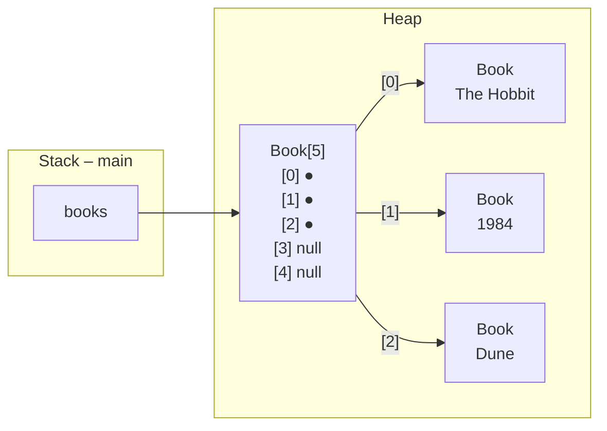

---

## Opgave 10 – Find en bog

```java
public static Book findByTitle(Book[] books, String title) {

    for (int i = 0; i < books.length; i++) {

        if (books[i] != null && books[i].getTitle().equals(title)) {
            return books[i];
        }
    }

    return null;
}
```

Bemærk `books[i] != null &&` først. Fordi `&&` stopper, så snart venstre side er `false`, bliver
`books[i].getTitle()` aldrig kaldt på en tom plads. Havde man byttet om på de to, ville det crashe.

Hos kalderen:

```java
Book found = findByTitle(books, "Dune");

if (found != null) {
    found.printInfo();
}
else {
    System.out.println("Bogen blev ikke fundet");
}

Book missing = findByTitle(books, "Ringenes Herre");

if (missing != null) {
    missing.printInfo();
}
else {
    System.out.println("Bogen blev ikke fundet");
}
```

```text
Dune (Herbert, 1965)
Bogen blev ikke fundet
```

`null` som returværdi betyder "ikke fundet" – ligesom `-1` fra `indexOf`. Og ligesom med `-1` er
det kalderens ansvar at tjekke, før resultatet bruges.

---

## Opgave 11 – Tæl og find

```java
public static int countBooks(Book[] books) {

    int count = 0;

    for (int i = 0; i < books.length; i++) {
        if (books[i] != null) {
            count++;
        }
    }

    return count;
}

public static Book findOldest(Book[] books) {

    Book oldest = null;

    for (int i = 0; i < books.length; i++) {

        if (books[i] == null) {
            continue;                        // spring tomme pladser over
        }

        if (oldest == null || books[i].getPublicationYear() < oldest.getPublicationYear()) {
            oldest = books[i];
        }
    }

    return oldest;
}

public static int countByAuthor(Book[] books, String author) {

    int count = 0;

    for (int i = 0; i < books.length; i++) {
        if (books[i] != null && books[i].getAuthor().equals(author)) {
            count++;
        }
    }

    return count;
}
```

Afprøvet med fire bøger i et array med fem pladser:

```text
Antal bøger: 4
Ældste bog: The Hobbit (Tolkien, 1937)
Bøger af Orwell: 2
Bøger af Rowling: 0
Ældste i tomt array: null
```

Det svære er `findOldest`. Man kan ikke starte med `oldest = books[0]`, for den kan være `null`.
Derfor starter `oldest` som `null`, og den *første* bog, loopet møder, bliver automatisk den
ældste indtil videre (`oldest == null ||`). Er arrayet helt tomt, returneres `null` – og det er det
rigtige svar.

---

## Opgave 12 – Bibliotek som klasse

```java
public class Library {

    private String name;
    private Book[] books;
    private int numberOfBooks;

    public Library(String name) {
        this.name = name;
        this.books = new Book[100];
        this.numberOfBooks = 0;
    }

    public void addBook(Book book) {

        if (numberOfBooks == books.length) {
            System.out.println("Biblioteket er fuldt");
            return;
        }

        books[numberOfBooks] = book;
        numberOfBooks++;
    }

    public void printBooks() {

        System.out.println("Bøger i " + name + ":");

        for (int i = 0; i < numberOfBooks; i++) {
            books[i].printInfo();
        }
    }

    public int getNumberOfBooks() {
        return numberOfBooks;
    }

    public Book findBookByTitle(String title) {

        for (int i = 0; i < numberOfBooks; i++) {

            if (books[i].getTitle().equals(title)) {
                return books[i];
            }
        }

        return null;
    }
}
```

```java
Library library = new Library("Min bogsamling");

library.addBook(new Book("The Hobbit", "Tolkien", 1937));
library.addBook(new Book("1984", "Orwell", 1949));
library.addBook(new Book("Dune", "Herbert", 1965));

library.printBooks();
System.out.println("Antal: " + library.getNumberOfBooks());

Book found = library.findBookByTitle("1984");

if (found != null) {
    found.printInfo();
}
else {
    System.out.println("Bogen blev ikke fundet");
}
```

```text
Bøger i Min bogsamling:
The Hobbit (Tolkien, 1937)
1984 (Orwell, 1949)
Dune (Herbert, 1965)
Antal: 3
1984 (Orwell, 1949)
```

**Hvad blev nemmere?**

* **Ingen `null`-tjek i loops.** Tælleren `numberOfBooks` garanterer, at pladserne `0` til
  `numberOfBooks - 1` er fyldt, så loopet kører kun dem igennem. I opgave 10-11 måtte hver metode
  selv tjekke hver plads.
* **Man skal ikke sende arrayet med.** `library.findBookByTitle("1984")` i stedet for
  `findByTitle(books, "1984")`. Objektet *har* sit array.
* **Ét sted at rette.** Vil man senere skifte arrayet ud med en `ArrayList`, sker det inde i
  `Library`. `Main` mærker ingenting. Det er præcis det, I gør i morgen.

---

# Del 4 – Klassediagrammer

## Opgave 13 – Tegn Book

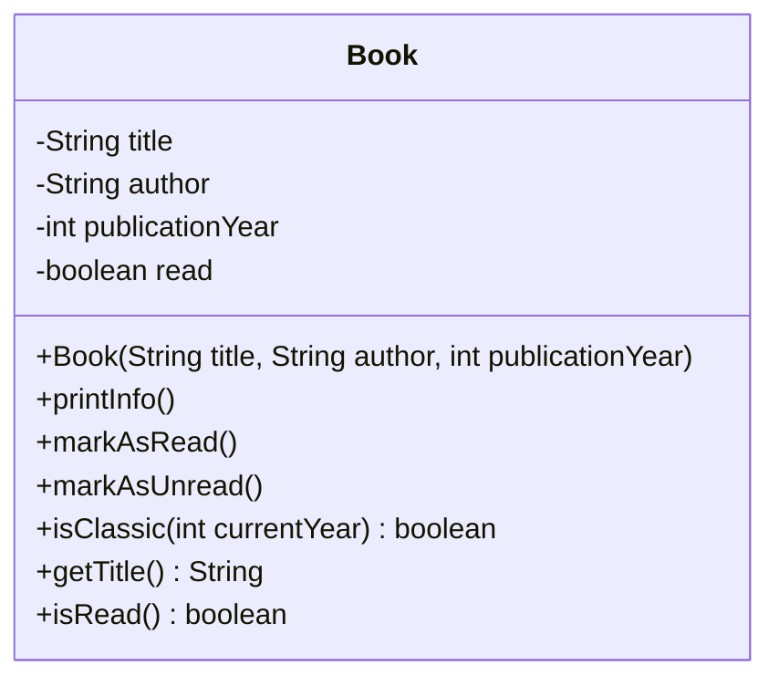

Attributter er `-` (private), metoder og constructor er `+` (public). Har din `Book` færre
metoder, er dit diagram tilsvarende mindre – det skal vise *din* klasse.

Gettere må godt udelades i et diagram, hvis de fylder for meget. Her er `getTitle()` og `isRead()`
taget med, fordi `Library` bruger dem – det er metoder, *andre klasser kalder*.

---

## Opgave 14 – Tegn Library og Book

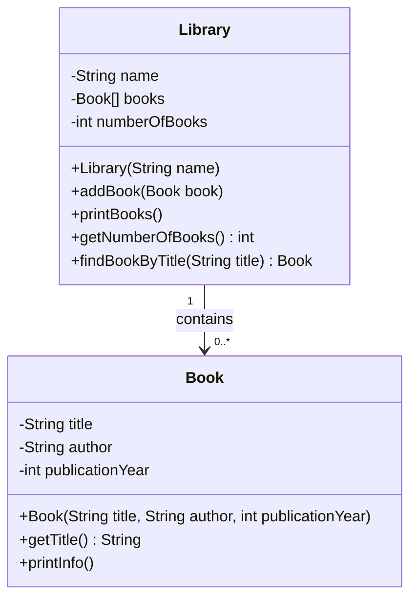

**Retningen:** Pilen går kun **fra `Library` til `Book`**. `Library` har en attribut af typen
`Book[]`, så den kender sine bøger. `Book` har ingen attribut af typen `Library` – en bog ved ikke,
hvilket bibliotek den står i. Skal den vide det, skal den have en attribut, og så bliver stregen
uden pil (begge veje). Det er ikke nødvendigt her, og jo færre klasser der kender hinanden, jo
nemmere er programmet at ændre.

**Multiplicitet:** Ét bibliotek har `0..*` bøger (arrayet kan være tomt). Strengt taget er det
`0..100`, fordi arrayet har 100 pladser – men det er en detalje i *implementeringen*, ikke i
*designet*, så `0..*` er det rigtige at tegne.

---

## Opgave 15 – Tegn bilen

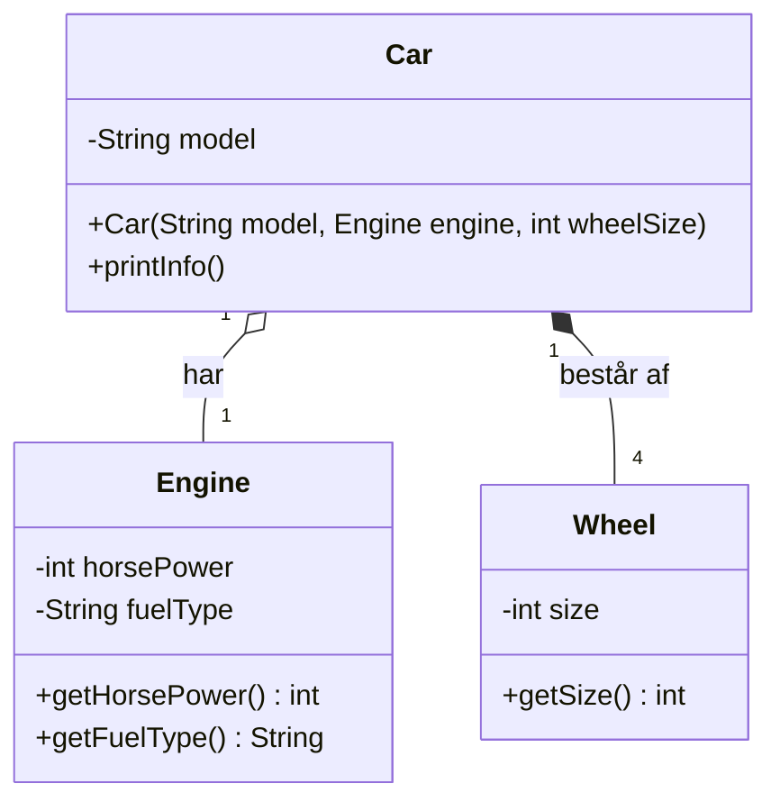

**Begrundelse:**

* **`Engine` – aggregation (hul rombe).** Motoren oprettes uden for bilen og gives med i
  constructoren. Den kan findes uden bilen, og den er ikke bilens ejendom. Multiplicitet `1`: en
  bil har præcis én motor.
* **`Wheel` – komposition (udfyldt rombe).** Hjulene oprettes af `Car` selv i constructoren, og
  ingen andre har en reference til dem. Uden bilen findes de ikke. Multiplicitet `4`: præcis fire,
  fordi constructoren altid laver fire.

Bemærk, at `engine` og `wheels` **ikke** står som attributter inde i `Car`-kassen. Når en relation
er tegnet som en streg, er det den samme oplysning – at skrive den begge steder er dobbelt.

---

## Opgave 16 – Fra diagram til kode

```java
public class Student {

    private String name;
    private int studentNumber;

    public Student(String name, int studentNumber) {
        this.name = name;
        this.studentNumber = studentNumber;
    }

    public String getName() {
        return name;
    }
}
```

```java
public class Teacher {

    private String name;
    private String initials;

    public Teacher(String name, String initials) {
        this.name = name;
        this.initials = initials;
    }

    public String getName() {
        return name;
    }
}
```

```java
public class Course {

    private String title;
    private int ects;
    private Student[] students;
    private int studentCount;
    private Teacher teacher;

    public Course(String title, int ects, Teacher teacher) {
        this.title = title;
        this.ects = ects;
        this.teacher = teacher;           // kommer udefra – præcis én
        this.students = new Student[50];  // 0..* deltagere
        this.studentCount = 0;
    }

    public void addStudent(Student student) {
        students[studentCount] = student;
        studentCount++;
    }

    public int getStudentCount() {
        return studentCount;
    }
}
```

Sådan læses diagrammet:

* `Course "1" o-- "0..*" Student` → `Course` har en attribut, der kan rumme *mange* studerende:
  et array (i morgen: en `ArrayList`). Den hule rombe siger, at de studerende kommer udefra – de
  oprettes ikke af kurset – så der skal være en `addStudent`-metode, og constructoren tager dem
  ikke.
* `Course "1" --> "1" Teacher` → `Course` har **én** attribut af typen `Teacher`. Præcis én, så
  den gives med i constructoren.
* Pilene peger *fra* `Course`. Hverken `Student` eller `Teacher` har en attribut, der peger
  tilbage.
* `+getName() String` → en public metode, der returnerer en `String`.

Tælleren `studentCount` står ikke i diagrammet. Det er fint: den er en detalje i, hvordan arrayet
håndteres, og ikke noget, andre klasser skal vide om.

---

## Opgave 17 – Tegn dit eget projekt

Det afhænger af, hvor langt du er. Sådan ser en typisk bogsamling ud efter opgave 15 i projektet:

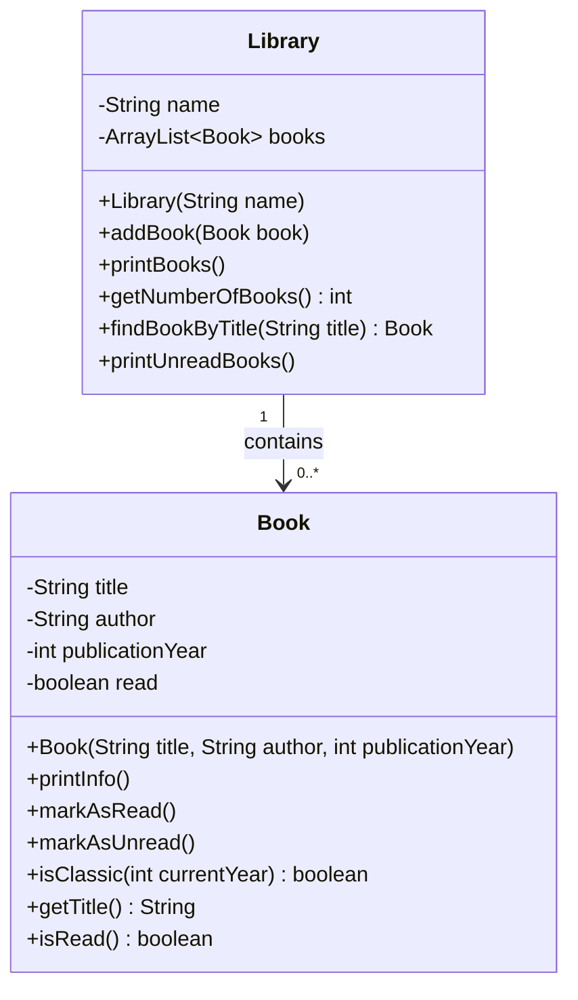

Ting, der typisk er anderledes end diagrammet i projektbeskrivelsen – og som er helt i orden:

* **Du har flere eller færre metoder.** Har du lavet ekstraopgaverne, er `removeBookByTitle` og
  `getNumberOfReadBooks` med. Har du ikke, er de ikke. Diagrammet skal vise *din* kode.
* **Du har udeladt gettere.** Projektets diagram viser kun `getTitle()` og `isRead()` – fordi det
  er dem, `Library` bruger. Det er en god regel: tag de metoder med, andre klasser kalder.
* **Du har skrevet returtyper på, eller ladet være.** Projektets diagram gør det ikke; det her gør.
  Begge dele er fint – vær konsekvent inden for samme diagram.
* **`Main` er ikke med.** Det skal den heller ikke være. Den har ingen attributter og er ikke en
  del af strukturen.

Er der forskelle, du *ikke* kan forklare – fx en pil den anden vej, eller en attribut i `Book` af
typen `Library` – så er det værd at kigge på, om koden gør det, du tror.

---

## Opgave 18 – Kig frem

Ud fra beskrivelsen: et `Room` har et navn, en beskrivelse og fire attributter af typen `Room`.

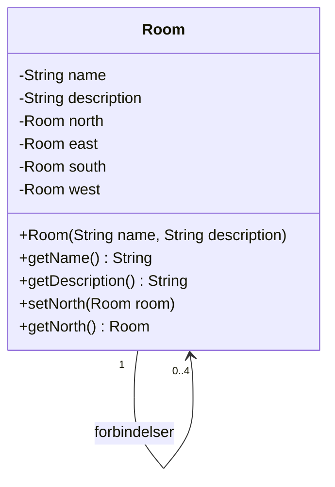

**Multipliciteten er `0..4`.** Et rum har fire attributter af typen `Room`, og hver af dem kan være
`null` – beskrivelsen siger netop, at `null` betyder "ingen dør den vej". Så et rum har mellem nul
og fire naboer. Det kan aldrig have fem, for der er kun fire attributter.

Man kunne argumentere for `1..4`, fordi alle ni rum på kortet har mindst én dør (ellers kunne man
ikke komme ind). Men det er en egenskab ved *det konkrete kort*, ikke ved *klassen*. Klassen
tillader et rum uden naboer – fx lige efter `new Room(...)`, før nogen har kaldt `setNorth`. Så
`0..4` er det rigtige.

**En klasse med relation til sig selv** ser mærkelig ud første gang. Men det er præcis det samme
som `Person --> Address` – bare hvor de to klasser tilfældigvis er den samme. Hvert `Room`-objekt
på heapen har fire pile, der peger på *andre* `Room`-objekter (eller er `null`). Tegn ni kasser
med pile imellem, så er det kortet.

Her er de fire `setter`/`getter`-par forkortet til `north` – de tre andre ser ens ud. Det er en
almindelig måde at holde diagrammet læseligt på; skriv gerne en note om det.

---

## Udfordring 1 – En playliste

Diagrammet først:

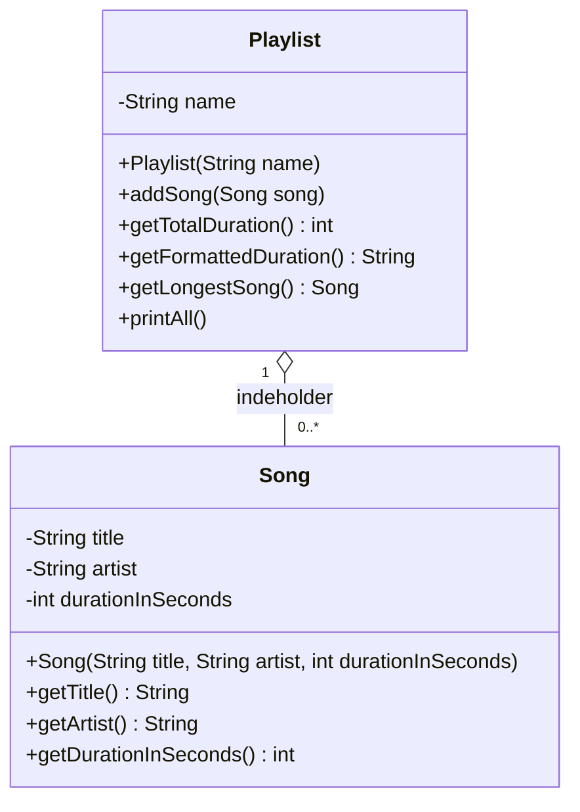

Aggregation, fordi sangene oprettes uden for playlisten og tilføjes med `addSong`. Den samme sang
kunne ligge i flere playlister.

```java
public class Song {

    private String title;
    private String artist;
    private int durationInSeconds;

    public Song(String title, String artist, int durationInSeconds) {
        this.title = title;
        this.artist = artist;
        this.durationInSeconds = durationInSeconds;
    }

    public String getTitle() {
        return title;
    }

    public String getArtist() {
        return artist;
    }

    public int getDurationInSeconds() {
        return durationInSeconds;
    }
}
```

```java
public class Playlist {

    private String name;
    private Song[] songs;
    private int numberOfSongs;

    public Playlist(String name) {
        this.name = name;
        this.songs = new Song[100];
        this.numberOfSongs = 0;
    }

    public void addSong(Song song) {
        songs[numberOfSongs] = song;
        numberOfSongs++;
    }

    public int getTotalDuration() {

        int total = 0;

        for (int i = 0; i < numberOfSongs; i++) {
            total += songs[i].getDurationInSeconds();
        }

        return total;
    }

    public String getFormattedDuration() {

        int total = getTotalDuration();

        int hours = total / 3600;
        int minutes = (total % 3600) / 60;
        int seconds = total % 60;

        return hours + ":" + String.format("%02d", minutes) + ":" + String.format("%02d", seconds);
    }

    public Song getLongestSong() {

        Song longest = null;

        for (int i = 0; i < numberOfSongs; i++) {
            if (longest == null || songs[i].getDurationInSeconds() > longest.getDurationInSeconds()) {
                longest = songs[i];
            }
        }

        return longest;
    }

    public void printAll() {

        System.out.println("Playliste: " + name + " (" + getFormattedDuration() + ")");

        for (int i = 0; i < numberOfSongs; i++) {
            Song song = songs[i];
            int minutes = song.getDurationInSeconds() / 60;
            int seconds = song.getDurationInSeconds() % 60;
            System.out.println("  " + song.getTitle() + " - " + song.getArtist()
                    + " (" + minutes + ":" + String.format("%02d", seconds) + ")");
        }
    }
}
```

```java
Playlist playlist = new Playlist("Kørekort");

playlist.addSong(new Song("Bohemian Rhapsody", "Queen", 354));
playlist.addSong(new Song("Hey Jude", "The Beatles", 431));
playlist.addSong(new Song("Smells Like Teen Spirit", "Nirvana", 301));
playlist.addSong(new Song("Stairway to Heaven", "Led Zeppelin", 482));

playlist.printAll();

System.out.println("Samlet længde i sekunder: " + playlist.getTotalDuration());

Song longest = playlist.getLongestSong();
if (longest != null) {
    System.out.println("Længste sang: " + longest.getTitle());
}
```

```text
Playliste: Kørekort (0:26:08)
  Bohemian Rhapsody - Queen (5:54)
  Hey Jude - The Beatles (7:11)
  Smells Like Teen Spirit - Nirvana (5:01)
  Stairway to Heaven - Led Zeppelin (8:02)
Samlet længde i sekunder: 1568
Længste sang: Stairway to Heaven
```

To ting at lægge mærke til:

* `getFormattedDuration()` **genbruger** `getTotalDuration()` i stedet for at lave sit eget loop.
  Én metode, ét ansvar.
* `String.format("%02d", seconds)` sørger for `5:04` i stedet for `5:4`. Det er samme `%`-syntaks
  som `printf`.

---

## Udfordring 2 – Cirkulære referencer

Tricket er at sætte **begge** sider ét sted, så man ikke kan glemme den ene. Her sker det i
`Course.addStudent`, som selv kalder `student.setCourse(this)`:

```java
public class Student {

    private String name;
    private Course course;

    public Student(String name) {
        this.name = name;
    }

    public String getName() {
        return name;
    }

    public Course getCourse() {
        return course;
    }

    public void setCourse(Course course) {
        this.course = course;
    }

    public void printTeacher() {

        if (course == null) {
            System.out.println(name + " er ikke tilmeldt et kursus");
            return;
        }

        System.out.println(name + " undervises af " + course.getTeacher().getName());
    }
}
```

```java
public class Course {

    private String title;
    private Teacher teacher;
    private Student[] students;
    private int studentCount;

    public Course(String title, Teacher teacher) {
        this.title = title;
        this.teacher = teacher;
        this.students = new Student[50];
        this.studentCount = 0;
    }

    public Teacher getTeacher() {
        return teacher;
    }

    public void addStudent(Student student) {
        students[studentCount] = student;      // den ene side ...
        studentCount++;
        student.setCourse(this);               // ... og den anden side
    }

    public void printStudents() {

        System.out.println("Studerende på " + title + ":");

        for (int i = 0; i < studentCount; i++) {
            System.out.println("  " + students[i].getName());
        }
    }
}
```

`Teacher` er den samme som i opgave 16.

```java
Teacher teacher = new Teacher("Tobias Grundtvig", "TOG");
Course course = new Course("Programmering", teacher);

Student anna = new Student("Anna");
Student bo = new Student("Bo");

course.addStudent(anna);
course.addStudent(bo);

course.printStudents();
anna.printTeacher();
bo.printTeacher();

Student carl = new Student("Carl");     // glemt: aldrig tilføjet til kurset
carl.printTeacher();
```

```text
Studerende på Programmering:
  Anna
  Bo
Anna undervises af Tobias Grundtvig
Bo undervises af Tobias Grundtvig
Carl er ikke tilmeldt et kursus
```

**`this`** er nyt her: inde i en metode betyder `this` "det objekt, metoden blev kaldt på". Så
`student.setCourse(this)` inde i `Course` betyder "sæt den studerendes kursus til *mig*".

**Hvad sker der, hvis man glemmer den ene side?**

* Glemmer man `student.setCourse(...)`, står Carl på kursets liste, men `carl.printTeacher()`
  giver `NullPointerException` (eller "ikke tilmeldt", hvis man tjekker). Kurset kender Carl, men
  Carl kender ikke kurset.
* Glemmer man `students[...] = student`, kan Carl udskrive sin underviser, men han står ikke på
  listen. Carl kender kurset, men kurset kender ikke Carl.

Ingen af delene giver en fejl, når man skriver koden. Fejlen viser sig først, når man går den
"forkerte" vej – og det er præcis Adventure-problemet: `room1.setEast(room2)` uden
`room2.setWest(room1)` giver et rum, man kan gå ind i, men ikke ud af.

**Fordel ved begge veje:** man kan gå fra en studerende til kurset *og* fra kurset til de
studerende uden at skulle lede. **Ulempe:** to steder at holde opdateret, og de kan komme ud af
sync. Derfor er reglen: lav **én** metode, der sætter begge sider, og brug altid den.

---

## Udfordring 3 – Tegn noget virkeligt

Der er ikke ét rigtigt svar. Her er en webshop som eksempel på en domænemodel – kun attributter og
relationer, ingen metoder:

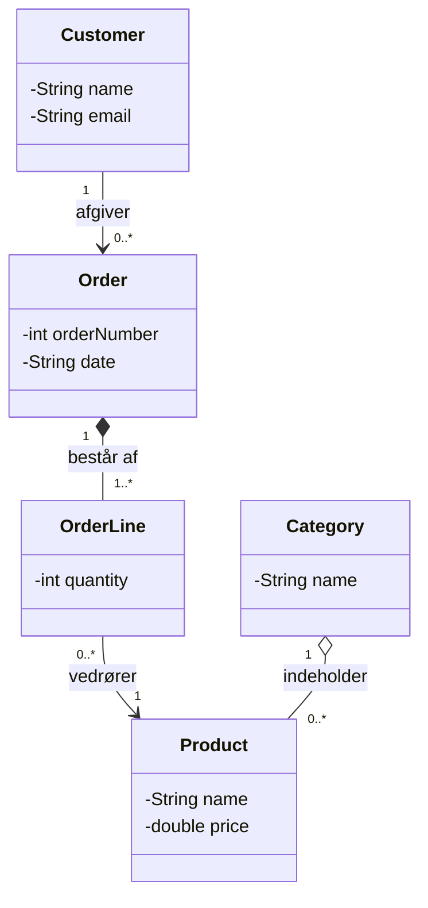

Sådan er romberne begrundet:

* **`Order` ◆ `OrderLine` – komposition.** En ordrelinje giver ingen mening uden sin ordre.
  Slettes ordren, forsvinder linjerne. En ordre har mindst én linje (`1..*`), ellers er det ikke
  en ordre.
* **`Category` ◇ `Product` – aggregation.** En kategori "har" produkter, men produktet findes
  stadig, hvis kategorien nedlægges – det flyttes bare til en anden.
* **`OrderLine` → `Product` – almindelig association.** En linje *henviser til* et produkt. Det
  samme produkt kan stå på tusindvis af linjer, så det ejes ikke af nogen af dem.
* **`Customer` → `Order`.** En kunde kan have nul ordrer (er lige oprettet). En ordre har præcis
  én kunde – det er `1`-tallet i den anden ende, som ikke er tegnet, fordi pilen kun går den ene
  vej.

Tjek, når I bytter med en anden gruppe:

* Kan de læse hver streg som en sætning? "Én kunde afgiver nul eller flere ordrer."
* Er der en rombe, de er uenige i? Godt – så er der noget at diskutere. Det vigtige er, at I kan
  begrunde valget.
* Mangler der en klasse, som teksten på pilene forudsætter? Hvis der står "betaler med", skal der
  nok være en `Payment`.
