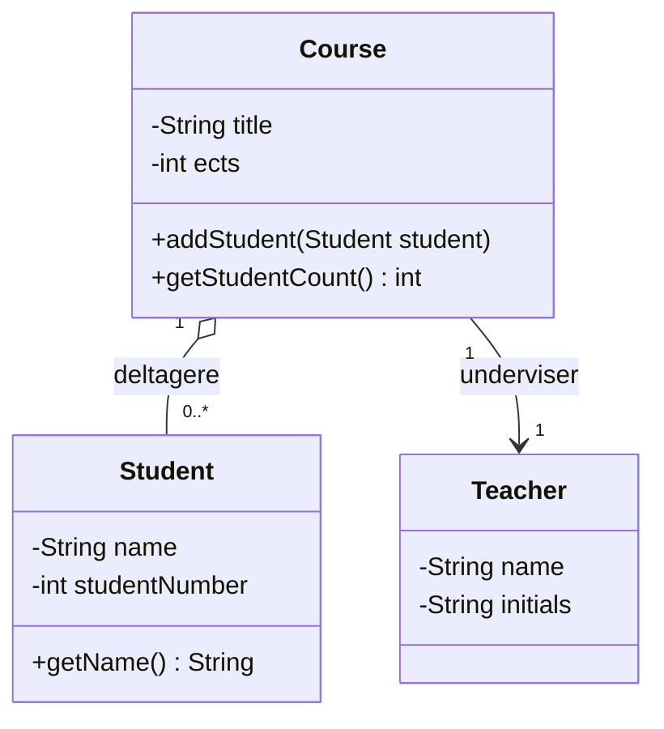

# Opgaver – Objekter i objekter. Klassediagrammer

Dagens opgaver veksler mellem at **kode** og at **tegne**. Begge dele tæller.

## Kom i gang

Opret et nyt Java-projekt, eller arbejd videre i det, du har.

Til tegneopgaverne: papir, [draw.io](https://app.diagrams.net/) eller Mermaid – hvad du foretrækker.

---

# Del 1 – Referencer

## Opgave 1 – Primitiv eller reference?

Skriv og kør begge programmer. Skriv ned, hvad de udskriver.

### a

```java
int a = 5;
int b = a;
b = 10;

System.out.println("a = " + a);
System.out.println("b = " + b);
```

### b

Lav først en simpel klasse:

```java
public class Counter {
    public int value = 0;
}
```

Og kør så:

```java
Counter c1 = new Counter();
Counter c2 = c1;

c2.value = 10;

System.out.println("c1.value = " + c1.value);
System.out.println("c2.value = " + c2.value);
```

Forklar for hinanden i gruppen, hvorfor de to programmer opfører sig forskelligt. Tegn det gerne.

## Opgave 2 – Tegn hukommelsen

Tegn på papir, hvad der sker linje for linje:

```java
Counter c1 = new Counter();
Counter c2 = new Counter();
Counter c3 = c1;

c1.value = 5;
c2.value = 10;
c3.value = 20;
```

Hvad er `c1.value`, `c2.value` og `c3.value` til sidst?

Hvor mange `Counter`-objekter blev der oprettet i alt?

## Opgave 3 – NullPointerException

```java
Counter c = null;

System.out.println(c);
System.out.println(c.value);
```

1. Hvad sker der på hver af de to linjer?
2. Hvorfor virker den første, men ikke den anden?
3. Tilføj et `if`, så programmet ikke crasher.

## Opgave 4 – == og equals

```java
String a = "hello";
String b = "hello";
String c = new String("hello");

System.out.println(a == b);
System.out.println(a == c);
System.out.println(a.equals(c));
```

1. Kør programmet. Blev resultatet, som du forventede?
2. Forklar hver af de tre linjer.

---

# Del 2 – Objekter i objekter

## Opgave 5 – Person og Address

Lav to klasser:

```java
public class Address {
    private String street;
    private String city;
    private String postalCode;
}
```

```java
public class Person {
    private String name;
    private Address address;
}
```

Krav:

* begge klasser skal have en constructor
* begge skal have gettere
* `Person` skal have en metode `printInfo()`, der skriver både navn og hele adressen ud

Afprøv i `main`:

```text
Anna
Nørrebrogade 1
2200 København
```

## Opgave 6 – Delt adresse

Udvid opgave 5:

1. Opret **ét** `Address`-objekt
2. Opret **to** `Person`-objekter, der begge bruger den samme adresse (de bor sammen)
3. Skriv begge personers info ud
4. Ændr `city` på adressen via den ene person
5. Skriv begge personers info ud igen

Hvad skete der? Var det, hvad du forventede? Er det en fordel eller en fælde?

## Opgave 7 – Ingen adresse

Udvid `Person` med en constructor, der **kun** tager et navn – uden adresse.

Sørg for at `printInfo()` ikke crasher, men i stedet skriver:

```text
Anna
(ingen adresse registreret)
```

## Opgave 8 – Bil, motor og hjul

Lav disse klasser:

```java
public class Engine {
    private int horsePower;
    private String fuelType;
}
```

```java
public class Wheel {
    private int size;
}
```

```java
public class Car {
    private String model;
    private Engine engine;
    private Wheel[] wheels;
}
```

Krav:

* en `Car` har **præcis fire** hjul, som oprettes af bilen selv i constructoren
* en `Car` får sin `Engine` **udefra** i constructoren
* `Car` skal have en metode `printInfo()`, der skriver model, motorens hestekræfter og hjulstørrelsen

Afprøv i `main`.

**Spørgsmål:** Hvilken af de to relationer (`Engine` og `Wheel`) er aggregation, og hvilken er
komposition? Begrund dit svar.

---

# Del 3 – Array af objekter

## Opgave 9 – Et array af bøger

Brug `Book`-klassen fra [bogsamlingsprojektet](../../projekter/bogsamling/readme.md), eller lav en
simpel udgave.

1. Lav et array med plads til 5 bøger
2. Skriv `books.length` ud
3. Skriv `books[0]` ud, **inden** du har fyldt noget i. Hvad står der?
4. Prøv `books[0].getTitle()`. Hvad sker der?
5. Fyld tre bøger i arrayet
6. Løb arrayet igennem med et loop og skriv alle bøger ud

Hvad sker der med de to tomme pladser? Hvordan undgår du at crashe?

## Opgave 10 – Find en bog

Skriv en metode:

```java
public static Book findByTitle(Book[] books, String title)
```

der returnerer bogen med den titel, eller `null` hvis den ikke findes.

Husk at bruge `.equals()` til at sammenligne titlerne.

Afprøv med både en titel, der findes, og en der ikke gør. Håndtér `null` hos kalderen.

## Opgave 11 – Tæl og find

Skriv disse metoder:

```java
public static int countBooks(Book[] books)              // hvor mange pladser er fyldt?
public static Book findOldest(Book[] books)             // ældste udgivelsesår
public static int countByAuthor(Book[] books, String author)
```

Alle tre skal kunne håndtere, at nogle pladser i arrayet er `null`.

## Opgave 12 – Bibliotek som klasse

Lav en klasse `Library`, der har:

* et navn
* et array af `Book` med plads til 100
* en tæller over, hvor mange bøger der faktisk er

Metoder:

```java
public void addBook(Book book)
public void printAllBooks()
public int getNumberOfBooks()
public Book findByTitle(String title)
```

Nu ligger metoderne fra opgave 10 og 11 der, hvor de hører hjemme – **på objektet**, ikke som
`static` metoder i `Main`.

Sammenlign med opgave 10-11: hvad blev nemmere?

---

# Del 4 – Klassediagrammer

## Opgave 13 – Tegn Book

Tegn et klassediagram for `Book`-klassen med attributter og metoder.

Brug `-` og `+` korrekt.

## Opgave 14 – Tegn Library og Book

Tegn begge klasser og relationen mellem dem, med multiplicitet.

Overvej: skal pilen gå den ene vej eller begge veje? Kender en `Book` sit `Library`?

## Opgave 15 – Tegn bilen

Tegn klassediagrammet for opgave 8: `Car`, `Engine` og `Wheel`.

Krav:

* brug rombe-notationen, hvor du mener, det er aggregation eller komposition
* sæt multiplicitet på alle relationer
* skriv en kort begrundelse under diagrammet for dine valg af rombe

## Opgave 16 – Fra diagram til kode

Skriv koden til dette diagram:



Du skal ikke implementere metodekroppene fuldt ud – men klasserne, attributterne og
constructorerne skal være der, og typerne skal passe.

## Opgave 17 – Tegn dit eget projekt

Tegn klassediagrammet for det, du har lavet i
[bogsamlingsprojektet](../../projekter/bogsamling/readme.md) indtil nu.

Tegn det **selv** – lad være med at bruge IntelliJs autogenerering.

Sammenlign med diagrammet nederst i projektbeskrivelsen. Er dit anderledes? Hvorfor?

## Opgave 18 – Kig frem

Læs beskrivelsen af [Adventure del 1](../../projekter/adventure/del-1-rooms.md), afsnittet **Koden**.

Tegn klassediagrammet for `Room`, som det er beskrevet der – inklusive relationen til sig selv.

Hvad bliver multipliciteten? Hvorfor?

> Om halvanden uge skal I bygge det. Nu har I set det.

---

## Udfordring 1 – En playliste

Lav klasserne:

* `Song` med titel, kunstner og længde i sekunder
* `Playlist` med et navn og et array af `Song`

`Playlist` skal have:

```java
public void addSong(Song song)
public int getTotalDuration()          // samlet længde i sekunder
public String getFormattedDuration()   // fx "1:23:45"
public Song getLongestSong()
public void printAll()
```

Tegn klassediagrammet, **inden** du koder.

## Udfordring 2 – Cirkulære referencer

Lav to klasser, hvor **begge** kender hinanden:

```java
public class Student {
    private String name;
    private Course course;
}

public class Course {
    private String title;
    private Student[] students;
}
```

1. Få det til at virke: opret en `Course`, opret nogle `Student`, og sørg for at begge sider peger
   rigtigt
2. Skriv en metode på `Student`, der udskriver navnet på kursets underviser
3. Hvad sker der, hvis du glemmer at sætte den ene side?

Diskutér i gruppen: Hvad er fordelen ved at kende hinanden begge veje? Hvad er ulempen?

> Det her er præcis det problem, I møder i Adventure, når `room1.east` skal pege på `room2`, og
> `room2.west` skal pege tilbage på `room1`. Glemmer man den ene side, kan man gå ind i et rum og
> ikke komme ud igen.

## Udfordring 3 – Tegn noget virkeligt

Vælg et system, du kender – en webshop, Spotify, et bibliotek, et fitnesscenter – og tegn et
klassediagram med 4-6 klasser.

Krav:

* mindst én aggregation eller komposition
* multiplicitet på alle relationer
* ingen metoder, kun attributter og relationer (det kaldes en **domænemodel**, og den skal I lave
  rigtigt i uge 47)

Byt med en anden gruppe. Kan de forstå jeres system uden forklaring?
