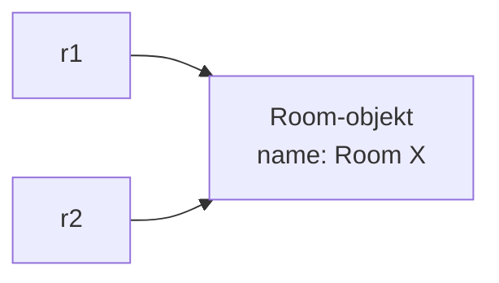
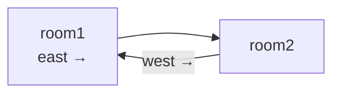

# Adventure del 1 – intro

## Beskrivelse

I dag går vi i gang med semesterets første store obligatoriske projekt: **[Adventure](../../projekter/adventure/readme.md)**.

Vi skal bygge et tekstbaseret eventyrspil i fem faser hen over de næste tre uger. I dag handler det
om første fase: **Rooms** – navigationen, hvor spilleren kan bevæge sig rundt mellem virtuelle rum.

Det tekniske omdrejningspunkt er **objektreferencer**. Kortet i spillet er ikke et array eller en
tabel. Kortet *er* rummene, der peger på hinanden. Forstår du det, forstår du en af de vigtigste
ting i objektorienteret programmering.

## Læringsmål

Når du har arbejdet med dagens materiale, skal du kunne:

* forklare forskellen på en **primitiv type** og en **referencetype**
* forklare hvad der ligger i en objektvariabel
* lade et objekt have en attribut af sin egen type
* bygge en datastruktur udelukkende af objekter, der refererer til hinanden
* forklare hvorfor en forbindelse skal sættes fra **begge** sider
* bruge `null` til at udtrykke "der er ingen forbindelse denne vej"
* komme i gang med [Adventure del 1](../../projekter/adventure/del-1-rooms.md)

## Se disse videoer før undervisningen:

[Primitive Types and Reference Types in Java](https://www.youtube.com/watch?v=OmcFVHpb0v0) (Neso Academy, 6 min.)

## Læs nedenstående før undervisningen

**Læs hele [Adventure-projektets forside](../../projekter/adventure/readme.md)** og
**[del 1 – Rooms](../../projekter/adventure/del-1-rooms.md)**, inden du møder op. Du skal kende
opgaven, når vi starter.

Derudover:

---

### To slags variable

Java har to fundamentalt forskellige slags variable, og forskellen er vigtigere, end den ser ud.

**Primitive typer** – `int`, `double`, `boolean`, `char`, `long`, `float`, `byte`, `short`.
Værdien ligger *i* variablen.

```java
int a = 5;
int b = a;      // b får en kopi

b = 10;

System.out.println(a);      // 5
```

**Referencetyper** – alle klasser, herunder `String`, arrays og dine egne klasser. Variablen
indeholder en **henvisning** til, hvor objektet ligger.

```java
Room r1 = new Room("Room 1", "A dark cave");
Room r2 = r1;      // r2 peger på det samme objekt

r2.setName("Room X");

System.out.println(r1.getName());      // Room X
```

Der er stadig kun **ét** Room-objekt. To variable peger bare på det.



Det her er ikke en kuriositet. Det er hele grundlaget for, at et Adventure-kort overhovedet kan
bygges.

---

### Et objekt der kender sin egen slags

Her er den idé, hele del 1 hviler på:

```java
public class Room {

    private String name;
    private String description;

    private Room north;
    private Room east;
    private Room south;
    private Room west;
}
```

Læg mærke til de fire nederste. En `Room` har fire attributter, der **selv er af typen `Room`**.

Det virker først lidt underligt – kan et rum indeholde fire rum, som hver indeholder fire rum, i
det uendelige?

Nej. For der ligger ikke *rum* i attributterne. Der ligger **henvisninger** til rum, som findes
andre steder. Ligesom en vejskilt ikke indeholder byen, den peger på.

### Kortet er rummene

Vi bygger kortet ved at oprette ni objekter og sætte deres henvisninger:

```java
Room room1 = new Room("Room 1", "A room with two doors");
Room room2 = new Room("Room 2", "Water drips from the ceiling");

room1.setEast(room2);
room2.setWest(room1);
```

Efter de to sidste linjer:



> **Der er ingen liste, intet array, ingen tabel over kortet.** Kortet er den struktur, der opstår,
> når objekterne peger på hinanden. Det er derfor, opgaven eksplicit forbyder at oprette et array
> med kortet: pointen er, at I skal arbejde med referencer.

### Begge veje – hver gang

Dette er den fejl, alle laver mindst én gang:

```java
room1.setEast(room2);      // og så glemmer man den næste linje
```

Nu kan du gå `east` fra rum 1 til rum 2 – men når du står i rum 2 og skriver `go west`, sker der
ingenting. Rum 2 ved ikke, at rum 1 findes.

Forbindelser skal sættes **fra begge sider**:

```java
room1.setEast(room2);
room2.setWest(room1);
```

> Vil du undgå fejlen helt, kan du lade `setEast` selv kalde `setWest` på det andet rum. Det er en
> af de [frivillige udvidelser](../../projekter/adventure/del-1-rooms.md#automatisk-forbindelse-frem-og-tilbage)
> – men pas på ikke at lave en uendelig løkke.

### `null` betyder "ingen dør"

Når et rum ikke har nogen nabo i en retning, er attributten `null`:

```java
Room next = currentRoom.getNorth();

if (next != null) {
    currentRoom = next;
    // udskriv det nye rums navn og beskrivelse
}
else {
    // "You cannot go that way"
}
```

Det er præcis den samme `null`, I mødte i sidste uge – og den samme
`NullPointerException`, hvis I glemmer at tjekke.

---

### Sådan hænger dagens teori sammen med opgaven

| Det du lærte | Sådan bruges det i del 1 |
| --- | --- |
| Referencetyper | `Room` har fire `Room`-attributter |
| To variable, ét objekt | `room1.east` og variablen `room2` peger på det samme |
| `null` | "der er ingen dør denne vej" |
| Objekter i objekter (15-09) | selve kortet |
| Metoder (10-09) | `move()`, `getNorth()`, `setEast()` |
| Betingelser (27-08) | "kan jeg gå den vej?" |
| Loops (01-09) | spillets hovedloop, der læser kommandoer |
| Strings (04-09) | fortolkning af `"go north"` |

Der er ikke rigtig noget nyt i dag ud over referencerne. **Det hele er ting, I allerede kan** – nu
skal de bare bruges sammen på noget større.

---

## Praktisk om projektet

* **Grupper på 2-3 personer**, svarende til en halv studiegruppe. Aftal grupper i dag.
* **Ét fælles GitHub-repository** pr. gruppe. Alle skal kunne pushe til det.
* Vi bruger **ikke branches** i dette projekt – det kommer efter efterårsferien.
* Projektet er en **bunden forudsætning**: alle fem dele skal afleveres, ellers bliver man ikke
  indstillet til eksamen.
* [Alle deadlines står på projektets forside](../../projekter/adventure/readme.md#afleveringer-og-deadlines).

Git og GitHub blev gennemgået i mandags. Er du usikker på det, så sig til med det samme – I skal
bruge det hver dag de næste tre uger.

---

## Det vigtigste at tage med

* primitive typer indeholder **værdien**, referencetyper indeholder en **henvisning**
* to variable kan pege på det samme objekt
* en klasse må gerne have attributter af sin egen type
* kortet i Adventure **er** rummene, der peger på hinanden – ingen arrays
* en forbindelse skal sættes fra **begge** sider
* `null` = "ingen dør denne vej"

## Aktiviteter i undervisningen

1. **Dan grupper** (2-3 personer) og opret jeres fælles GitHub-repository.
2. Vi gennemgår [projektbeskrivelsen](../../projekter/adventure/readme.md) sammen og ser på kortet.
3. Arbejd med [Adventure del 1 – Rooms](../../projekter/adventure/del-1-rooms.md).

Følg den [anbefalede procedure](../../projekter/adventure/del-1-rooms.md#anbefalet-procedure) i
opgavebeskrivelsen. Start med brugerfladen **uden** rum – få den til at genkende kommandoerne
først. Så ét rum. Så resten.

> **Sid to personer ved én computer, og skriv programmet sammen.** Der er ikke meget at dele op i
> denne fase, og det er vigtigere at alle forstår referencerne end at koden bliver færdig hurtigt.
> Brug evt. *Code With Me* i IntelliJ.

**Deadline for del 1: fredag 25-09 kl. 23:59.** På fredag rydder vi op i koden – se
[del 1 – refactor](../../projekter/adventure/del-1-refactor.md).
