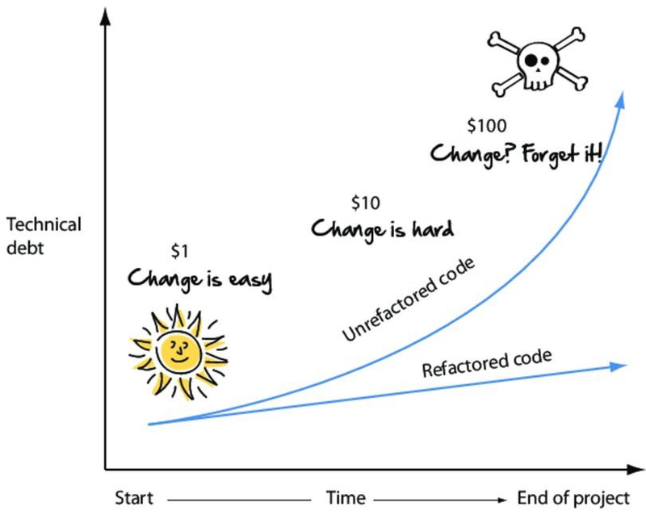
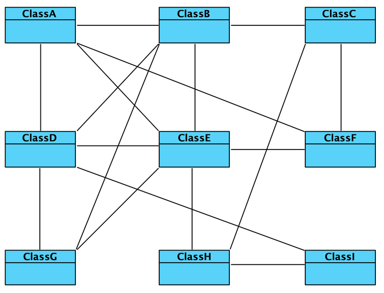
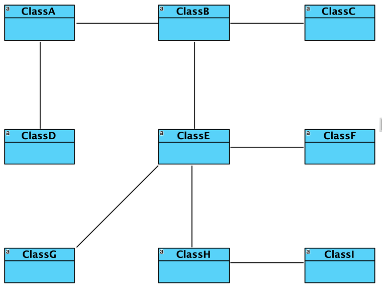
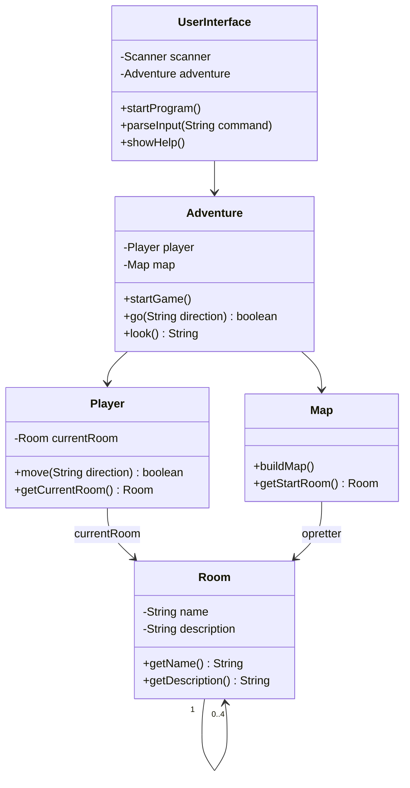

# Adventure del 1 – refactor

## Beskrivelse

I har fået Adventure del 1 til at virke. Nu skal der ryddes op – **før** vi bygger videre.

At **refaktorere** vil sige at ændre kodens struktur uden at ændre, hvad den gør. Ingen nye
features. Ingen ændret opførsel. Bare bedre kode.

Det lyder som spild af tid, når programmet allerede virker. Det er det ikke. Vi har fire faser
tilbage i dette projekt, og hver af dem bygger oven på det, I har nu. Den kode, I går herfra med i
dag, skal holde til meget mere.

I dag lærer vi de designprincipper, der fortæller os **hvor** koden skal deles op: Single
Responsibility, Controller, Creator, Information Expert – og begreberne **coupling** og
**cohesion**.

## Læringsmål

Når du har arbejdet med dagens materiale, skal du kunne:

* forklare hvad refaktorering er, og hvad det **ikke** er
* forklare **Single Responsibility Principle** og anvende det på din egen kode
* forklare rollerne **Controller** og **Creator** og placere dem i dit program
* forklare **Information Expert** og **Law of Demeter**
* forklare hvad **coupling** og **cohesion** er, og hvorfor vi vil have lav kobling og høj samhørighed
* argumentere for, hvor et ansvar hører hjemme
* tegne et klassediagram over dit eget refaktorerede program

## Se disse videoer før undervisningen:

Ingen video i kursusrækken til dagens emne. Læs i stedet:

* [Refactoring: clean your code](https://refactoring.guru/refactoring) (refactoring.guru) – læs
  *What is refactoring?* og *Why refactor?*
* [Opgavebeskrivelsen til del 1 – refactor](../../projekter/adventure/del-1-refactor.md)

## Læs nedenstående før undervisningen

---

### Hvad er refaktorering?

> **Refaktorering** er at ændre kodens **struktur** uden at ændre dens **opførsel**.

Det er vigtigt at holde de to ting adskilt. Når du refaktorerer, laver du **ikke** nye features og
retter **ikke** fejl. Du flytter rundt. Bagefter skal programmet gøre præcis det samme som før – og
det er sådan, du tester, at du gjorde det rigtigt.

Derfor: **commit din fungerende kode, før du begynder.** Så kan du altid komme tilbage.

### Hvorfor ikke bare vente?

Fordi teknisk gæld vokser eksponentielt:



Rodet kode koster ikke noget den første dag. Den koster hver eneste dag derefter – og prisen
stiger. Vi har tre uger tilbage i dette projekt, så investeringen tjener sig ind med det samme.

---

### Cohesion og coupling

To begreber, der går igen resten af uddannelsen.

**Cohesion (samhørighed)** handler om, hvad der foregår *inde i* én klasse. Høj cohesion betyder,
at alt i klassen hører sammen om ét formål.

En klasse, der både læser input, beregner priser og skriver til en fil, har **lav** cohesion. Den
laver tre forskellige ting.

**Coupling (kobling)** handler om, hvor meget klasserne *afhænger af hinanden*. Lav kobling betyder,
at hver klasse kun kender de få andre, den har brug for.

**Vi vil have høj cohesion og lav kobling.**

Sådan ser høj kobling ud – alle kender alle.



Og lav kobling – hver klasse kender kun sine naboer.



Hvorfor betyder det noget? Fordi et godt design er:

* **let at forstå** – du kan læse én klasse uden at læse hele programmet
* **let at teste** – du kan afprøve én klasse for sig
* **let at vedligeholde** – en ændring ét sted vælter ikke noget andet sted

Med høj kobling gælder ingen af delene. Hver ændring risikerer at ramme alt.

---

### Single Responsibility Principle

> **En klasse skal have ét ansvar – og dermed kun én grund til at blive ændret.**

Det er den konkrete måde at få høj cohesion på.

I jeres nuværende Adventure ligger formentlig alt i `Adventure`-klassen: brugerfladen, kortet,
spillerens position og selve spillet. Det er fire ansvar i én klasse.

Prøv at spørge: **hvorfor kunne jeg få brug for at ændre i denne klasse?**

* Fordi udskrifterne skal se anderledes ud
* Fordi kortet skal have flere rum
* Fordi reglerne for at flytte sig ændrer sig

Tre svar = tre ansvar = klassen skal deles.

### De fire klasser

| Klasse | Ansvar | Ændres når ... |
| --- | --- | --- |
| `UserInterface` | **Al** input og output | udskrifterne skal se anderledes ud |
| `Adventure` | Styrer programmets flow | spillets regler ændrer sig |
| `Map` | Bygger kortet | der skal være flere rum |
| `Player` | Ved hvor spilleren er, og flytter sig | reglerne for bevægelse ændrer sig |
| `Room` | Kender sit navn, beskrivelse og naboer | rummene skal indeholde mere |

**Den vigtigste regel:** `UserInterface` er den **eneste** klasse, der må have
`System.out.println` og `scanner.nextLine()`. Alle andre klassers metoder **returnerer data** eller
**modtager parametre**.

Det virker besværligt i starten. Men det er dét, der gør, at man senere kan skifte konsollen ud med
en grafisk brugerflade uden at røre spillogikken.

---

### GRASP: hvem skal have ansvaret?

GRASP er en samling navngivne svar på spørgsmålet "hvilken klasse skal have dette ansvar?". Vi
bruger fire af dem i dag.

#### Controller – hvem styrer flowet?

> Den klasse, der koordinerer, hvad der sker hvornår, og som er **single point of entry** fra
> brugerfladen ind i systemet.

`Adventure` er den oplagte kandidat. Vi kan udelukke `UserInterface` (den har allerede ansvar for
brugerdialogen) og `Map` (den har ansvar for at bygge kortet).

`UserInterface` behøver så kun at kende **to** ting: sin `Scanner` og sin `Adventure`. Det er lav
kobling i praksis.

#### Creator – hvem opretter objekterne?

> Normalt får "container"-klassen ansvaret for at oprette de objekter, den indeholder.

Men at bygge kortet er en **specialopgave**: ni rum, navne, beskrivelser og alle forbindelserne.
Lægger vi den i `Adventure`, får den for mange forskellige typer opgaver.

Derfor får kortet sin egen klasse, `Map`, der kaldes af controlleren, inden spillet går i gang.

#### Information Expert – hvem har data?

> Giv ansvaret til den klasse, der har de oplysninger, der skal til for at løse opgaven.

Eksempel: Hvem skal flytte spilleren?

`Adventure` **kunne** bede `Player` om at returnere `currentRoom`, selv finde naboen og selv sætte
den nye `currentRoom`. Men så skal `Adventure` kende både `Player` og `Room` i detaljer.

`Player` har allerede `currentRoom`. Så lad `Player` gøre det selv:

```java
public boolean move(String direction) {

    Room desiredRoom = switch (direction) {
        case "north", "n" -> currentRoom.getNorthRoom();
        case "south", "s" -> currentRoom.getSouthRoom();
        case "east",  "e" -> currentRoom.getEastRoom();
        case "west",  "w" -> currentRoom.getWestRoom();
        default -> null;
    };

    if (desiredRoom != null) {
        currentRoom = desiredRoom;
        return true;
    }
    else {
        return false;
    }
}
```

`Adventure` beder blot: `player.move("north")` og får `true` eller `false` tilbage.

#### Law of Demeter – tal kun med dine venner

> Et objekt bør kun kalde metoder på: sig selv, sine egne attributter, sine parametre, og objekter
> det selv har oprettet.

Kort sagt: **undgå lange kæder af punktummer.**

Dette er et dårligt tegn:

```java
adventure.getPlayer().getCurrentRoom().getNorthRoom().getName()
```

Her kender den, der skriver linjen, hele strukturen fire niveauer ned. Ændrer noget sig undervejs,
knækker linjen.

Bedre: spørg den, der ved det.

---

### Navngivning

Når I opretter klasserne, så brug **ikke** navne som `Controller` og `Creator`. De er
softwaredesignerens ord for en rolle – ikke ord fra jeres spil.

Brug navne, der fortæller den, der læser koden, **hvad klassen gør** i jeres Adventure. `Map`,
`Player`, `UserInterface` og `Adventure` fortæller noget. `GameController` og `RoomFactory` gør ikke.

---

### Sådan kunne resultatet se ud



Læg mærke til, at `UserInterface` kun har **én** pil ud. Den kender ikke `Room`, `Player` eller
`Map`. Det er hele pointen.

> Det er **et** muligt design, ikke facit. Kan I argumentere for et andet, er det fint – så længe
> argumentet er noget bedre end "sådan gjorde vi bare".

---

## Det vigtigste at tage med

* refaktorering = ændre **struktur**, ikke **opførsel** — commit først!
* teknisk gæld vokser eksponentielt: ryd op nu, ikke senere
* **høj cohesion** (alt i klassen hører sammen) og **lav kobling** (kend så få som muligt)
* **Single Responsibility**: én klasse, ét ansvar, én grund til at ændre
* `UserInterface` er den eneste klasse med `println` og `nextLine`
* **Controller** = `Adventure`, **Creator** = `Map`, **Information Expert** = den der har data
* **Law of Demeter**: undgå `a.getB().getC().getD()`
* brug navne fra jeres eget spil, ikke fra designmønstrene

## Aktiviteter i undervisningen

1. **Aflever del 1 først** – deadline er i dag kl. 23:59, men sørg for at have en fungerende version
   pushet, inden I begynder at rykke rundt.
2. Vi kigger på hinandens løsninger fra del 1 og diskuterer, hvordan de kan forenkles.
3. Arbejd med [Adventure del 1 – refactor](../../projekter/adventure/del-1-refactor.md).

### Rækkefølge, der plejer at virke

1. Træk **al** input/output ud i `UserInterface`. Ingen `println` andre steder. Denne alene er den
   største forbedring.
2. Træk opbygningen af kortet ud i `Map`.
3. Lav `Player`, og flyt `currentRoom` og bevægelsen derover.
4. Kig på, hvad der er tilbage i `Adventure`. Er det nu kun koordinering?
5. Tegn klassediagrammet.

> **Sid sammen om det.** Oprydning er dårlig at dele op – I kommer til at rykke i de samme filer.

### Til diskussion i gruppen

* Hvor mange grunde er der til at ændre i jeres nuværende `Adventure`-klasse?
* Hvilke klasser kender hvilke? Tegn det, og se om nogen kender for mange.
* Hvis vi i næste uge skal have ting, man kan samle op – hvor i jeres design hører de hjemme?

**Deadline for del 1: i dag kl. 23:59.** Refaktoreringen skal være færdig, inden I går i gang med
[del 2](../../projekter/adventure/del-2-items.md) på mandag.
