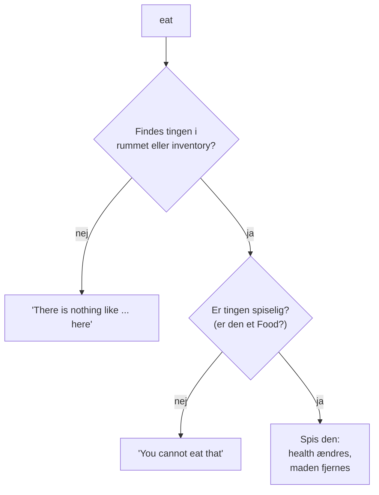
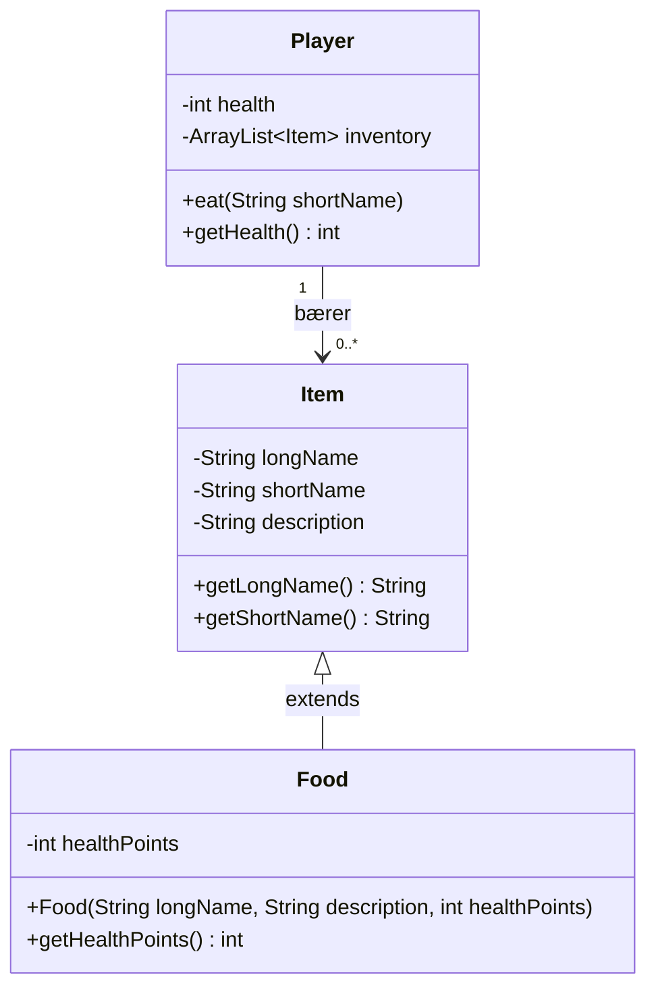
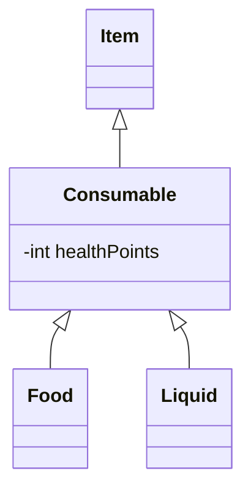

# Adventure del 3 – Food

> **Bunden forudsætning.** Del af det samlede [Adventure-projekt](readme.md).
>
> Det er her, vi tager **arv** i brug for første gang.

## Beskrivelse

I skal arbejde videre på adventure-spillet. Hvor version 2 medførte, at man kunne samle ting op og
efterlade dem igen, skal der nu være **forskellige typer ting**: mad og våben, hvor man kan spise
mad og affyre våben.

For at gøre det nemt for os selv, laver vi én ting ad gangen. Først mad! Altid først mad!!

## Læringsmål

Når du er færdig med denne del, skal du kunne:

* forklare hvad **arv** er, og hvad en subklasse arver fra sin superklasse
* skrive `class Food extends Item`
* forklare hvorfor et `Food`-objekt **også er** et `Item` (*is-a*-relationen)
* bruge en overloaded constructor og kalde `super(...)`
* skrive kode, der behandler subklasse-objekter gennem superklassens type
* håndtere flere forskellige udfald af én kommando

---

## Krav

### Spillet

De ting, der ligger i rummene, skal enten blot være "ting", eller de skal være **mad der kan
spises**, eller **våben der kan bruges i angreb**.

Spilleren skal have en form for **health**, som kan øges ved at spise (sundt) mad, og mindskes ved
at spise gift eller usund mad – samt i senere udgaver blive angrebet af fjender.

### Brugerfladen

Spillet skal udvides med to kommandoer:

| Kommando | Betydning |
|---|---|
| `health` | Viser spillerens aktuelle health-status – både som tal og forklarende tekst |
| `eat <mad>` | Tager den nævnte mad enten fra rummet eller fra spillerens inventory og spiser den |

`health` er super-simpel, i hvert fald for brugerfladen: den skal blot udskrive spillerens
nuværende health. For eksempel:

```text
health: 50 - you are in good health, but avoid fighting right now
```

`eat` er noget mere kompliceret end `take` og `drop`. **Der er tre forskellige udfald:**



* Hvis man skriver `eat` efterfulgt af en ting, som **hverken er i rummet eller i inventory**,
  svarer det til at `take` eller `drop` et item, der ikke findes.
* Hvis man skriver `eat` efterfulgt af en ting, der **ikke er spiseligt**, skal programmet udskrive,
  at man ikke kan spise den pågældende ting.
* **Kun** hvis tingen findes *og* er spiselig, bliver den spist.

Når maden er spist, **holder den op med at eksistere**, og spilleren får en mængde health fra den.

Eksempel:

```text
> health
health: 100 - you are in perfect health

> eat lamp
You cannot eat the shiny brass lamp

> eat bread
You eat the loaf of stale bread. You feel a little better.

> health
health: 110 - you are in perfect health

> eat mushroom
You eat the pale glowing mushroom. That was a mistake.

> health
health: 60 - you are in good health, but avoid fighting right now
```

### Koden

I skal have én klasse, **`Food`**, der **arver fra `Item`**.

> Men det skal være muligt at behandle den som et helt almindeligt item, så det kan tilføjes,
> fjernes, takes og droppes ligesom alle andre items, **uden at koden dertil skal ændres det
> mindste.**

I `Map`, hvor rum og items oprettes, opretter I også `Food`-objekter og tilføjer dem til rooms, som
var de almindelige items.

#### Food

`Food`-objekter skal have et antal **`healthPoints`**, som er det, player optager, når den spiser
et food-objekt. Det kan også være et **negativt tal**, hvis det f.eks. er gift!

Lav for eksempel en **overloaded constructor**, der udover name og description også tager health –
så `healthPoints` bliver fastlagt, når `Map` opretter de `Food`-objekter, der skal være i spillet.



Bemærk at `Player` stadig har en liste af **`Item`** – ikke af `Food`. Et `Food`-objekt kan ligge i
den liste, fordi et `Food` **er et** `Item`.

---

## Anbefalet procedure

1. **Start med `health`-kommandoen** – den er forholdsvis ligetil, og så er I i gang.

2. **Arbejd derefter med `Food`:**

   1. Start med at oprette klassen, og tilføj nogle `Food`-objekter til mappet. Test at man kan
      samle dem op og droppe dem, som almindelige items.
   2. Lav derefter `eat`-kommandoen, og vær især opmærksom på **de tre forskellige outcomes**, og
      sørg for at alt output er i `UserInterface`.
   3. Tilføj i `eat`-metoden, at health forandres med madens `healthPoints`, og husk at fjerne
      `Food`-objektet fra rummet eller inventory, så det ikke kan spises igen!

Efter hvert trin skal I selvfølgelig teste, at spillet stadig virker som forventet.

---

## Frivillige udvidelser

Der er ikke mange udvidelsesmuligheder til `Food`, men her er et par forslag:

### Klogere håndtering af giftig mad (i brugerfladen)

`Food` kan have negative `healthPoints`, og selv om spilleren ikke får `healthPoints` at se, før
maden er spist, så kunne programmet give en advarsel, inden man prøver at spise noget giftigt.

Måske et spørgsmål i stil med: *"This doesn't look healthy, are you sure you want to eat it?"* hvor
spilleren så skal svare yes eller no.

Det kræver endnu en returværdi fra `eat`-metoden, og måske en opdeling i en `tryToEat` og
`reallyEat` metode …

### Flere typer "consumables"

I stedet for at alt spiseligt er `Food`, kunne der være både `Food` og `Liquid`, der hver især
arver fra `Consumable`, der så arver fra `Item`.

De to klasser skal fungere ens mht. healthpoints, og den eneste forskel er, at brugeren skal skrive
`eat` for food-objekter, og `drink` for liquid-objekter.



---

## Aflevering

Det er ikke super-vigtigt at aflevere denne udgave, men brug den gerne som mulighed for at få
feedback, før I kaster jer over Weapons.

**Hvordan:** Push til samme repository som hidtil, og gen-aflevér linket.

**Hvornår:** Inden I går i gang med [Weapons (del 4)](del-4-weapons.md) – se
[deadlines i projektoversigten](readme.md#afleveringer-og-deadlines).

I er velkomne til at spørge ind til jeres løsning eller tanker om jeres løsning i dagens vejledning.

---

## Øvelser til arv

Til undervisningen hører disse to øvelser, som træner arv isoleret fra Adventure-projektet:

* **Arv-øvelsen** – klasserne `Konto`, `NemKonto` og `OpsparingsKonto`.
  Klon [DAT24_InheritanceExercise](https://github.com/ETALATE/DAT24_InheritanceExercise) og udfyld
  klasserne ud fra klassediagrammet.
* **Abstrakte klasser** – lav en abstrakt klasse `Animal` med en alder og en abstrakt metode
  `makeSound()`. Lav `Dog` og `Cat`, der extender `Animal` og implementerer `makeSound()`. `Dog`
  skal desuden have en metode `dogYears()`, der skriver hundens alder ud i både år og hundeår
  (alder gange 7).

---

**Næste:** [Del 4 – Weapons](del-4-weapons.md)
