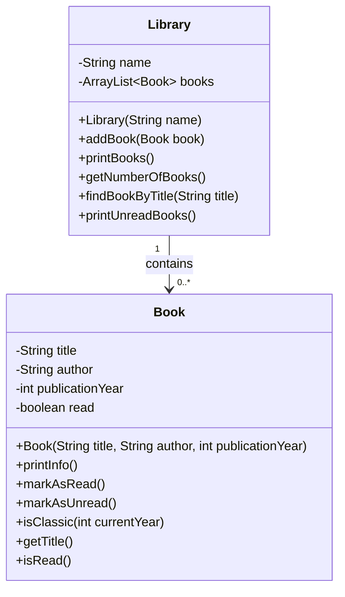

# Projekt: Min bogsamling

## Formål

I dette projekt skal du udvikle et simpelt Java-program, hvor man kan oprette bøger og samle dem i en bogsamling.

Projektet starter med én simpel klasse, `Book`, og udvides derefter med en ny klasse, `Library`, som kan indeholde mange bøger.

Formålet er, at du træner centrale begreber inden for objektorienteret programmering:

* klasser og objekter
* attributter
* constructors
* metoder
* objektets tilstand
* samarbejde mellem objekter
* `ArrayList`
* 1:mange-relation mellem objekter

Projektet er et konsolprogram og skal laves i IntelliJ.

---

## Kom godt i gang

Opret et nyt Java-projekt i IntelliJ.

Opret derefter en klasse med navnet `Main`.

I `Main` skal du oprette en `main`-metode:

```java
public class Main {

    public static void main(String[] args) {
        // Her skal du afprøve dine klasser og metoder
    }
}
```

Alle løsninger skal afprøves fra `main`-metoden.

---

# Del 1: Klassen Book

## Opgave 1: Opret klassen Book

Opret en ny klasse med navnet `Book`.

Klassen skal have følgende attributter:

```java
private String title;
private String author;
private int publicationYear;
```

---

## Opgave 2: Tilføj en constructor

Tilføj en constructor til `Book`, så man kan oprette en bog med titel, forfatter og udgivelsesår.

Eksempel på brug:

```java
Book book = new Book("The Hobbit", "J.R.R. Tolkien", 1937);
```

---

## Opgave 3: Opret bogobjekter i Main

I `main`-metoden skal du oprette mindst tre forskellige bøger.

Eksempel:

```java
Book book1 = new Book("The Hobbit", "J.R.R. Tolkien", 1937);
Book book2 = new Book("Harry Potter og De Vises Sten", "J.K. Rowling", 1997);
Book book3 = new Book("1984", "George Orwell", 1949);
```

---

## Opgave 4: Tilføj metoden printInfo

Tilføj en metode i `Book`, der udskriver information om bogen.

Metoden skal hedde:

```java
public void printInfo()
```

Når metoden kaldes, skal den udskrive bogens titel, forfatter og udgivelsesår.

Eksempel på output:

```text
Titel: The Hobbit
Forfatter: J.R.R. Tolkien
Udgivelsesår: 1937
```

Afprøv metoden i `main`.

---

## Opgave 5: Tilføj læsestatus

Tilføj en ny attribut til `Book`:

```java
private boolean read;
```

Når en bog oprettes, skal `read` som udgangspunkt være `false`.

Udvid `printInfo()`, så den også udskriver, om bogen er læst.

---

## Opgave 6: Tilføj metoder til læsestatus

Tilføj følgende metoder til `Book`:

```java
public void markAsRead()
public void markAsUnread()
```

Metoden `markAsRead()` skal ændre bogens læsestatus til `true`.

Metoden `markAsUnread()` skal ændre bogens læsestatus til `false`.

Afprøv begge metoder i `main`.

---

## Opgave 7: Tilføj getters

Tilføj getters for alle attributter i `Book`.

Eksempel:

```java
public String getTitle() {
    return title;
}
```

Du skal som minimum bruge en getter for `title` senere i projektet.

---

## Opgave 8: Klassisk bog

Tilføj en metode til `Book`, der undersøger, om en bog er mere end 20 år gammel.

Metoden skal hedde:

```java
public boolean isClassic(int currentYear)
```

Eksempel:

```java
boolean classic = book1.isClassic(2026);
```

Metoden skal returnere `true`, hvis bogen er mere end 20 år gammel. Ellers skal den returnere `false`.

---

# Del 2: Klassen Library

Nu skal projektet udvides med en ny klasse, `Library`.

Et bibliotek skal kunne indeholde mange bøger.

Det betyder, at der er en 1:mange-relation mellem `Library` og `Book`:

```text
Et Library har mange Book-objekter
```

---

## Opgave 9: Opret klassen Library

Opret en ny klasse med navnet `Library`.

Klassen skal have følgende attributter:

```java
private String name;
private ArrayList<Book> books;
```

Husk at importere `ArrayList`:

```java
import java.util.ArrayList;
```

---

## Opgave 10: Tilføj constructor til Library

Tilføj en constructor, hvor man kan give biblioteket et navn.

Når et `Library`-objekt oprettes, skal listen med bøger også oprettes.

Eksempel:

```java
public Library(String name) {
    this.name = name;
    this.books = new ArrayList<>();
}
```

Afprøv i `main`:

```java
Library library = new Library("Min bogsamling");
```

---

## Opgave 11: Tilføj bøger til biblioteket

Tilføj en metode i `Library`, der kan tilføje en bog til listen.

Metoden skal hedde:

```java
public void addBook(Book book)
```

Afprøv metoden i `main`:

```java
library.addBook(book1);
library.addBook(book2);
library.addBook(book3);
```

---

## Opgave 12: Udskriv alle bøger

Tilføj en metode i `Library`, der udskriver alle bøger i biblioteket.

Metoden skal hedde:

```java
public void printBooks()
```

Metoden skal bruge en løkke til at gennemløbe listen af bøger og kalde `printInfo()` på hver bog.

Afprøv metoden i `main`.

---

## Opgave 13: Antal bøger

Tilføj en metode i `Library`, der returnerer antallet af bøger i biblioteket.

Metoden skal hedde:

```java
public int getNumberOfBooks()
```

Afprøv metoden i `main`:

```java
System.out.println("Antal bøger: " + library.getNumberOfBooks());
```

---

## Opgave 14: Find en bog ud fra titel

Tilføj en metode i `Library`, der kan finde en bog ud fra dens titel.

Metoden skal hedde:

```java
public Book findBookByTitle(String title)
```

Metoden skal gennemløbe listen af bøger.

Hvis titlen findes, skal metoden returnere den fundne bog.

Hvis titlen ikke findes, skal metoden returnere `null`.

Eksempel på brug:

```java
Book foundBook = library.findBookByTitle("The Hobbit");

if (foundBook != null) {
    foundBook.printInfo();
} else {
    System.out.println("Bogen blev ikke fundet.");
}
```

---

## Opgave 15: Vis ulæste bøger

Tilføj en metode i `Library`, der kun viser de bøger, som ikke er læst.

Metoden skal hedde:

```java
public void printUnreadBooks()
```

Metoden skal gennemløbe listen af bøger og kun udskrive de bøger, hvor `read` er `false`.

Overvej hvilken getter du har brug for i `Book`.

---

# Del 3: Ekstra opgaver

Hvis du bliver færdig, kan du arbejde videre med en eller flere af disse opgaver.

---

## Ekstraopgave 1: Fjern en bog

Lav en metode i `Library`, der kan fjerne en bog ud fra titel.

Metoden kan hedde:

```java
public boolean removeBookByTitle(String title)
```

Metoden skal returnere `true`, hvis en bog blev fjernet, og `false`, hvis bogen ikke blev fundet.

---

## Ekstraopgave 2: Genre

Tilføj en genre til `Book`.

Start simpelt med en `String`:

```java
private String genre;
```

Udvid constructor og `printInfo()`.

Derefter kan du overveje at lave genre som en `enum`.

Eksempel:

```java
public enum Genre {
    FANTASY,
    CRIME,
    SCIENCE_FICTION,
    HISTORY,
    BIOGRAPHY
}
```

---

## Ekstraopgave 3: Søg efter forfatter

Lav en metode i `Library`, der viser alle bøger af en bestemt forfatter.

Metoden kan hedde:

```java
public void printBooksByAuthor(String author)
```

---

## Ekstraopgave 4: Tæl læste bøger

Lav en metode i `Library`, der returnerer antallet af læste bøger.

Metoden kan hedde:

```java
public int getNumberOfReadBooks()
```

---

## Ekstraopgave 5: Simpel menu

Lav en simpel tekstmenu i `main`.

Menuen kan for eksempel have disse valg:

```text
1. Tilføj bog
2. Vis alle bøger
3. Find bog
4. Marker bog som læst
5. Vis ulæste bøger
6. Afslut
```

Du kan bruge `Scanner` til at læse input fra brugeren.

---

# Klassediagram

Projektet kan beskrives med følgende klassediagram:



---

# Læringsmål

Når du er færdig med projektet, skal du kunne:

* oprette dine egne klasser
* oprette objekter ud fra en klasse
* forklare forskellen på en klasse og et objekt
* bruge attributter til at gemme data i et objekt
* skrive constructors
* skrive metoder, der ændrer objektets tilstand
* bruge getters
* arbejde med `ArrayList`
* forklare en simpel 1:mange-relation mellem to klasser
* få objekter til at samarbejde med hinanden

---

# Aflevering eller fremvisning

Du skal kunne fremvise:

* klassen `Book`
* klassen `Library`
* klassen `Main`
* mindst tre bogobjekter
* et `Library`-objekt med flere bøger
* en metode, der tilføjer bøger
* en metode, der udskriver alle bøger
* en metode, der finder en bog ud fra titel

Du skal også kunne forklare, hvorfor der er en 1:mange-relation mellem `Library` og `Book`.

